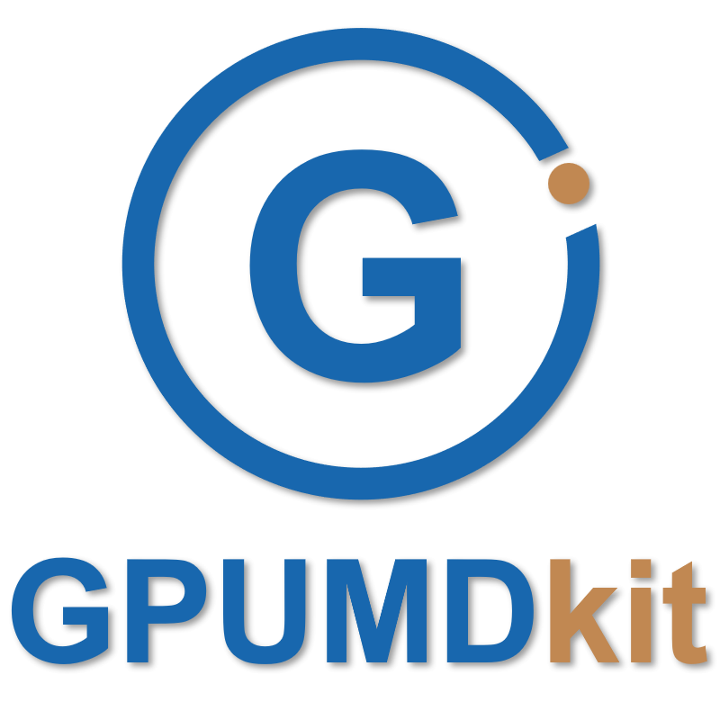
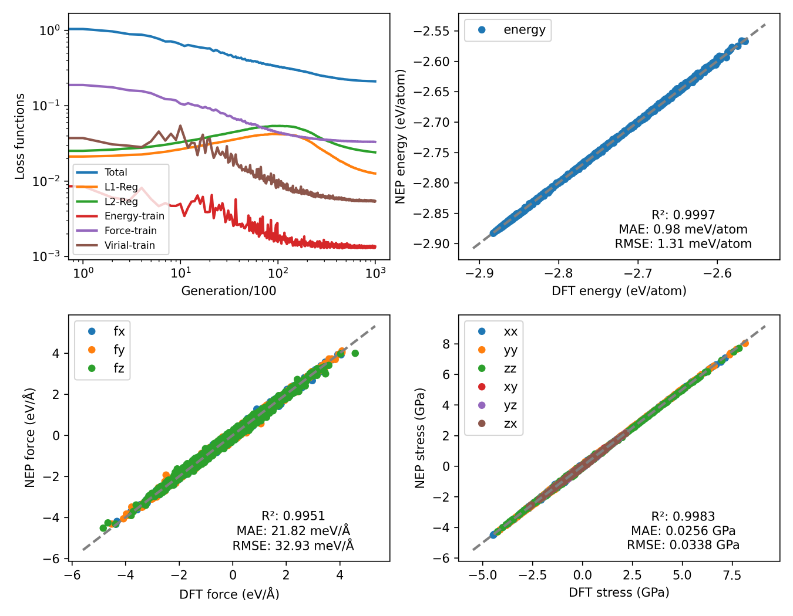
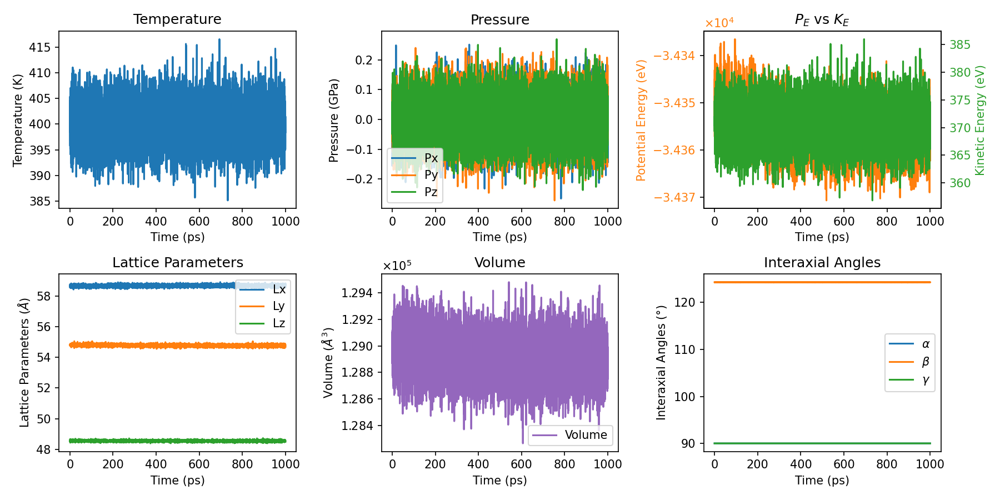

<div align="center">
<a href="https://zhyan0603.github.io/GPUMDkit">
  
</a><br>
<a href="https://github.com/zhyan0603/GPUMDkit/releases"></a>
<a href="https://github.com/zhyan0603/GPUMDkit/blob/main/LICENCE"></a>
<a href="https://github.com/zhyan0603/GPUMDkit/stargazers"></a>

<p style="text-align: justify;"><strong>GPUMDkit</strong> is a toolkit for the GPUMD (<em>Graphics Processing Units Molecular Dynamics</em>) and NEP (<em>neuroevolution potential</em>) program. It offers a user-friendly command-line interface to streamline common scripts and workflows, simplifying tasks such as script invocation, format conversion, structure sampling, NEP construction workflow, and various analysis, aiming to improve user productivity.</p>
</div>


## Features
- **Simplified Script Invocation**: Easily run scripts for GPUMD and NEP.
- **Workflow Automation**: Automate common tasks to save time and reduce manual intervention.
- **User-Friendly Interface**: Intuitive shell commands designed to enhance user experience.

## Installation
To install `GPUMDkit`, follow these steps:

1. Clone the repository or download the whole project.

    ```
    git clone https://github.com/zhyan0603/GPUMDkit.git
    ```

    use `-b` options if you want to download the specified branch, for example:

    ```
    git clone -b dev https://github.com/zhyan0603/GPUMDkit.git
    ```

2. Run the following command:
   
    ```
    cd GPUMDkit; source ./install.sh
    ```
    
    then
    
    ```sh
    source ~/.bashrc
    ```

## Dependencies

Some advanced features of `GPUMDkit` require some Python packages:

```bash
# Create a clean conda environment
conda create -n gpumdkit python=3.12
conda activate gpumdkit

# Install the required packages
pip install neptrain ase pymatgen dpdata
```

Tip: Make sure the `gpumdkit` environment is activated before using `GPUMDkit` features.

## Update

If your device has access to `github`, simply run this command:

```
gpumdkit.sh -update
```

Otherwise you will need to download the new package manually.

```
wget https://github.com/zhyan0603/GPUMDkit/archive/refs/heads/main.zip
```

## Usage

There are two options, <u>*interactive mode*</u> and <u>*command-line mode*</u>

#### Interactive Mode

---

1. Open your terminal.

2. Execute the `gpumdkit.sh` script:

   ```
   gpumdkit.sh
   ```

3. Follow the on-screen prompts to interactively select and run the desired function.

    ```
             ____ ____  _   _ __  __ ____  _    _ _
            / ___|  _ \| | | |  \/  |  _ \| | _(_) |_
           | |  _| |_) | | | | |\/| | | | | |/ / | __|
           | |_| |  __/| |_| | |  | | |_| |   <| | |_
            \____|_|    \___/|_|  |_|____/|_|\_\_|\__|
    
            GPUMDkit Version 1.5.3 (dev) (2026-03-18)
      Core Developer: Zihan YAN (yanzihan@westlake.edu.cn)
    
     ----------------------- GPUMD -----------------------
     1) Format Conversion          2) Sample Structures
     3) Workflow                   4) Calculators
     5) Analyzer                   6) Developing ...
     0) Quit!
     ------------>>
     Input the function number:
    ```

#### Command-Line Mode

----

For users familiar with the `GPUMDkit` , the command-line mode allows for faster execution by directly passing arguments to `gpumdkit.sh`. Here are some examples:

##### Example 1: View help information

```
gpumdkit.sh -h
```

the help information:

```
+==================================================================================================+
|                              GPUMDkit 1.5.3 (dev) (2026-03-18) Usage                             |
+======================================== Conversions =============================================+
| -out2xyz       Convert OUTCAR to extxyz       | -pos2exyz     Convert POSCAR to extxyz           |
| -cif2pos       Convert cif to POSCAR          | -pos2lmp      Convert POSCAR to LAMMPS           |
| -cif2exyz      Convert cif to extxyz          | -lmp2exyz     Convert LAMMPS-dump to extxyz      |
| -addgroup      Add group label                | -addweight    Add weight to the struct in extxyz |
| -cp2k2xyz      Convert CP2K file to extxyz    | -traj2exyz    Convert ASE traj to extxyz         |
| -xdat2exyz     Convert XDATCAR to extxyz      | Developing...                                    |
+========================================= Analysis ===============================================+
| -range         Print range of energy etc.     | -max_rmse     Get max RMSE from extxyz           |
| -min_dist      Get min_dist between atoms     | -min_dist_pbc Get min_dist considering PBC       |
| -filter_box    Filter struct by box limits    | -filter_value Filter struct by value (efs)       |
| -filter_dist   Filter struct by min_dist      | -analyze_comp Analyze composition of extxyz      |
| -pynep         Sample struct by pynep         | Developing...                                    |
+====================================== Misc Utilities ============================================+
| -plt           Plot scripts                   | -get_frame     Extract the specified frame       |
| -calc          Calculators                    | -frame_range   Extract frames by fraction range  |
| -clean         Clear files for work_dir       | -clean_xyz     Clean extra info in XYZ file      |
| -time          Time consuming Analyzer        | -update        Update GPUMDkit                   |
+==================================================================================================+
| For detailed usage and examples, use: gpumdkit.sh -<option> -h                                   |
+==================================================================================================+
```

##### Example 2: View help information for -plt

```
gpumdkit.sh -plt -h
```

the help information:

```
+=====================================================================================================+
|                              GPUMDkit 1.5.3 (dev) (2026-03-18) Plotting Usage                       |
+=============================================== Plot Types ==========================================+
| thermo          Plot thermo info                   | train          Plot NEP train results          |
| prediction      Plot NEP prediction results        | train_test     Plot NEP train and test results |
| msd             Plot mean square displacement      | msd_conv       Plot the convergence of MSD     |
| msd_all         Plot MSD of all species            | sdc            Plot self diffusion coefficient |
| rdf             Plot radial distribution function  | vac            Plot velocity autocorrelation   |
| restart         Plot parameters in nep.restart     | dimer          Plot dimer plot                 |
| force_errors    Plot force errors                  | des            Plot descriptors                |
| charge          Plot charge distribution           | lr             Plot learning rate              |
| doas            Plot density of atomistic states   | net_force      Plot net force distribution     |
| sigma           Plot Arrhenius sigma               | D              Plot Arrhenius diffusivity      |
| sigma_xyz       Plot directional Arrhenius sigma   | D_xyz          Plot directional Arrhenius D    |
| emd             Plot EMD results                   | nemd           Plot NEMD results               |
| hnemd           Plot HNEMD results                 | pdos           Plot VAC and PDOS               |
| plane-grid      Plot displacement plane grid       | parity_density Plot parity plot density        |
| cohesive        Plot cohsive energy                | viscosity      Plot visconsity                 |
| rdf_pmf         Plot potential of mean force (PMF) |                                                |
+=====================================================================================================+
| For detailed usage and examples, use: gpumdkit.sh -plt <plot_type> -h                               |
+=====================================================================================================+
```

##### Example 3: Convert VASP OUTCARs to extxyz

To convert a `VASP` `OUTCARs` to an extended XYZ format (`extxyz`) file, use the following command:

```
gpumdkit.sh -out2xyz <dir_of_OUTCARs>

Example: gpumdkit.sh -out2xyz .
```

##### Example 4: Plot loss and parity plots

To visualize the evolution of various terms and parity plots:

```
gpumdkit.sh -plt train
```

<div align="center">
    
</div>

##### Example 5: Plot thermo evolution

To visualize `thermo` evolution from `thermo.out` :

```
gpumdkit.sh -plt thermo
```



You can also save images as PNG if your device doesn't support visualization:

```
gpumdkit.sh -plt thermo save
```

Refer to our [documentation](https://zhyan0603.github.io/GPUMDkit/htmls/tutorials.html) for more detailed examples and command options.

#### Custom Commands

`GPUMDkit` now supports custom commands via `~/.gpumdkit.in`.

You can add your own shortcuts (e.g., `gpumdkit.sh -yourcommand`) by defining some functions in this file. This allows you to extend `GPUMDkit` with personal scripts. See [here](https://zhyan0603.github.io/GPUMDkit/htmls/custom_commands.html) for the detail usage.

#### Tab Completion Support

`gpumdkit.sh` provides optional Bash `Tab` completion to enhance the command-line experience. This feature allows you to auto-complete primary options (e.g., `-h`, `-plt`, `-calc`) and their secondary parameters (e.g., `thermo`, `train`) by pressing the `Tab` key.

##### Usage Examples

- Type `gpumdkit.sh -<Tab>` to see all available options.
- Type `gpumdkit.sh -plt <Tab>` to list plotting sub-options like `thermo`, `train`, etc.
- Type `gpumdkit.sh -time <Tab>` to see calculator options like `gpumd`, `nep`.

## Join Us 

We’d love your help to improve **GPUMDkit**! Contribute by:

- Adding Python/Shell scripts via [Pull Requests](https://github.com/zhyan0603/GPUMDkit/pulls).
- Report issues or suggest features via [issues](https://github.com/zhyan0603/GPUMDkit/issues).
- Contacting me at [yanzihan@westlake.edu.cn](mailto:yanzihan@westlake.edu.cn).

Also, welcome to join our QQ group ([825696376](https://qun.qq.com/universal-share/share?ac=1&authKey=buBNi1ADDzIFF2oZ1yA5FywG3LA9EL9yKZmb%2BN2MMz7nNuuxTas54wH7BgPEqP0s&busi_data=eyJncm91cENvZGUiOiI4MjU2OTYzNzYiLCJ0b2tlbiI6IlRxL1RLTDlOK3U2ekRSUXJ1TkNTUWd3ODNVV3BrdG9HN2lWWmJKMHAraGlDNzBZWFFyRUY2dUlSaW8rbUd4MisiLCJ1aW4iOiIxNDg5NjQ3MTc5In0%3D&data=fa4zSsT_IdI4ftCT_wwpytYHf--TaTB35lH0Jac5JHVpYoyXw3_3bZ1l1NZejsOZnGJku5u3BCbf5_bgrCkhZg&svctype=4&tempid=h5_group_info)). Let’s build something useful together! 🌟

## Citation

**GPUMDkit** is an open-source tool freely available for everyone. If you find it helpful in your research or workflow, please ⭐ [star us on GitHub](https://github.com/zhyan0603/GPUMDkit). Additionally, if GPUMDkit contributes to your published work, please cite our paper:

> Z. Yan, D. Li, X. Wu, Z. Liu, C. Hua, B. Situ, H. Yang, S. Tang, B. Tang, Z. Wang, S. Yi, H. Wang, D. Huang, K. Li, Q. Guo, Z. Chen, K. Xu, Y. Wang, Z. Wang, G. Tang, S. Liu, Z. Fan, and Y. Zhu. **GPUMDkit: A User-Friendly Toolkit for GPUMD and NEP**. [arXiv:2603.17367](https://arxiv.org/abs/2603.17367). 