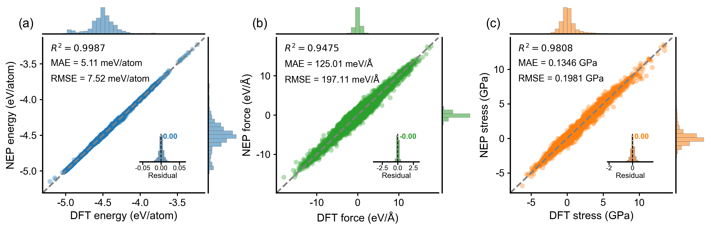

<p align="center">
  
</p>
<p align="center">
  <strong>English</strong>
  &nbsp;·&nbsp;
  <a href="./README_zh-CN.md">简体中文</a>
  &nbsp;·&nbsp;
  <a href="https://zhyan0603.github.io/GPUMDkit/">Website</a> &nbsp;·&nbsp;
  <a href="https://zhyan0603.github.io/GPUMDkit/htmls/tutorials.html">Documentation</a>
  &nbsp;·&nbsp;
  <a href="https://zhyan0603.github.io/GPUMDkit/gallery.html">Gallery</a>
  &nbsp;
</p>
<p align="center">
  <a href="https://github.com/zhyan0603/GPUMDkit/releases"></a>
  <a href="https://github.com/zhyan0603/GPUMDkit/blob/main/LICENCE"></a>
  <a href="https://github.com/zhyan0603/GPUMDkit/stargazers"></a>
  
  <a href="https://github.com/zhyan0603/GPUMDkit/graphs/contributors"></a>
</p>
<p style="text-align: justify;"><strong>GPUMDkit</strong> is a toolkit for the GPUMD (<em>Graphics Processing Units Molecular Dynamics</em>) and NEP (<em>neuroevolution potential</em>) program. It offers a user-friendly command-line interface to streamline common scripts and workflows, simplifying tasks such as script invocation, format conversion, structure sampling, NEP construction workflow, and various analysis, aiming to improve user productivity.</p>

## Features
- **Simplified Script Invocation**: Easily run scripts for GPUMD and NEP.
- **Workflow Automation**: Automate common tasks to save time and reduce manual intervention.
- **User-Friendly Interface**: Intuitive shell commands designed to enhance user experience.

## Installation
To install `GPUMDkit`, follow these steps:

1. Clone the repository or download the whole project.

    ```
    git clone https://github.com/zhyan0603/GPUMDkit.git
    ```

    use `-b` options if you want to download the specified branch, for example:

    ```
    git clone -b dev https://github.com/zhyan0603/GPUMDkit.git
    ```

2. Run the following command:
   
    ```
    cd GPUMDkit; source ./install.sh
    ```
    

## Dependencies

Some advanced features of `GPUMDkit` require some Python packages:

```bash
# Create a clean conda environment
conda create -n gpumdkit python=3.12
conda activate gpumdkit

# Install the required packages
pip install neptrain ase pymatgen dpdata
```

Tip: Make sure the `gpumdkit` environment is activated before using `GPUMDkit` features.

## Update

If your device has access to `github`, simply run this command:

```
gpumdkit.sh -update
```

Otherwise you will need to download the new package manually.

```
wget https://github.com/zhyan0603/GPUMDkit/archive/refs/heads/main.zip
```

## Usage

There are two options, <u>*interactive mode*</u> and <u>*command-line mode*</u>

#### Interactive Mode

---

1. Open your terminal.

2. Execute the `gpumdkit.sh` script:

   ```
   gpumdkit.sh
   ```

3. Follow the on-screen prompts to interactively select and run the desired function.

    ```
               ____ ____  _   _ __  __ ____  _    _ _
              / ___|  _ \| | | |  \/  |  _ \| | _(_) |_
             | |  _| |_) | | | | |\/| | | | | |/ / | __|
             | |_| |  __/| |_| | |  | | |_| |   <| | |_
              \____|_|    \___/|_|  |_|____/|_|\_\_|\__|
    
              GPUMDkit Version 1.5.5 (dev) (2026-05-10)
        Core Developer: Zihan YAN (yanzihan@westlake.edu.cn)
     Main Contributors: Denan LI, Xin WU, Zhoulin LIU & Chen HUA
    
     ---------------------- GPUMD ------------------------
     1) Format Conversion          2) Sample Structures
     3) Workflow                   4) Calculators
     5) Analyzer                   6) Visualization
     7) Utilities                  8) Developing...
     0) Exit
     ------------>>
     Input the function number:
    ```

#### Command-Line Mode

----

For users familiar with the `GPUMDkit` , the command-line mode allows for faster execution by directly passing arguments to `gpumdkit.sh`. Here are some examples:

##### Example 1: View help information

```
gpumdkit.sh -h
```

the help information:

```
+-------------------------------------------------------------------------------------------------------+
|                          GPUMDkit 1.5.5 (dev) (2026-05-10) Command Help                               |
+-------------------------------------------------------------------------------------------------------+
|                                          MAIN FUNCTIONS                                               |
+-------------------------------------------------------------------------------------------------------+
| -h            Show this help table            | -plt <type>        Plot and visualization tools       |
| -calc <type>  Calculator tools                | -time <gpumd|nep>  Time-consuming analyzer            |
| -update       Update GPUMDkit                 | -clean             Clean extra files in current dir   |
+-------------------------------------------------------------------------------------------------------+
|                                         FORMAT CONVERSION                                             |
+-------------------------------------------------------------------------------------------------------+
| -out2xyz      OUTCAR -> extxyz (shell)        | -out2exyz          OUTCAR -> extxyz (python)          |
| -cp2k2xyz     CP2K log -> xyz                 | -xdat2exyz         XDATCAR -> extxyz                  |
| -cif2pos      cif -> POSCAR                   | -cif2exyz          cif -> extxyz                      |
| -pos2exyz     POSCAR -> extxyz                | -exyz2pos          extxyz -> POSCAR                   |
| -pos2lmp      POSCAR -> LAMMPS data           | -lmp2exyz          LAMMPS dump -> extxyz              |
| -traj2exyz    ASE traj -> extxyz              | -replicate         Replicate structure                |
| -addgroup     Add group labels                | -addweight         Add structure weight in extxyz     |
| -clean_xyz    Clean extra info in extxyz      | -get_frame         Extract specific frame             |
| -frame_range  Extract frames by range         |                                                       |
+-------------------------------------------------------------------------------------------------------+
|                                            ANALYSIS                                                   |
+-------------------------------------------------------------------------------------------------------+
| -range        Energy/force/virial statistics  | -analyze_comp      Analyze composition                |
| -chem_species Analyze chemical species        | -cbc               Charge balance check               |
| -min_dist     Min distance (no PBC)           | -min_dist_pbc      Min distance with PBC              |
| -filter_dist  Filter by min_dist (no PBC)     | -filter_dist_pbc   Filter by min_dist (PBC)           |
| -pda          Probability density analysis    | -hbond             Hydrogen-bond analysis             |
| -pynep        FPS sampling by PyNEP           |                                                       |
+-------------------------------------------------------------------------------------------------------+
| Detailed usage: gpumdkit.sh -<option> -h    Plot details: gpumdkit.sh -plt <type> -h                  |
+-------------------------------------------------------------------------------------------------------+
```

##### Example 2: View help information for -plt

```
gpumdkit.sh -plt -h
```

the help information:

```
 +-----------------------------------------------------------------------------------------------+
 |                     GPUMDkit 1.5.5 (dev) (2026-05-10) PLOT & VISUALIZATION TOOLS              |
 +-----------------------------------------------------------------------------------------------+
 |  Usage: gpumdkit.sh -plt <type>                        Help: gpumdkit.sh -plt <type> -h       |
 +-----------------------------------------------------------------------------------------------+
 |                                    NEP Training & Evaluation                                  |
 +-----------------------------------------------------------------------------------------------+
 |  train          - NEP training results           prediction     - NEP prediction results      |
 |  train_test     - NEP train and test results     parity_density - Parity density plot         |
 |  train_density  - Training results density plot  restart        - Parameters in nep.restart   |
 |  charge         - Charge distribution            born_charge    - Born effective charges      |
 |  dimer          - Dimer energy/force curve       force_errors   - Force errors                |
 |  des            - Descriptors                    lr             - Learning rate for gnep      |
 +-----------------------------------------------------------------------------------------------+
 |                                     Diffusion & Transport                                     |
 +-----------------------------------------------------------------------------------------------+
 |  msd            - Mean square displacement       msd_conv       - MSD convergence             |
 |  msd_all        - MSD for all species            sdc            - Self diffusion coefficient  |
 |  msd_sdc        - MSD and SDC together           sigma          - Arrhenius ionic conductivity|
 |  D              - Arrhenius diffusivity          sigma_xyz      - Directional Arrhenius sigma |
 |  D_xyz          - Directional Arrhenius D                                                     |
 +-----------------------------------------------------------------------------------------------+
 |                                    MD & Structural Analysis                                   |
 +-----------------------------------------------------------------------------------------------+
 |  thermo         - thermo info in thermo.out      thermo2/3      - Thermo in different styles  |
 |  rdf            - Radial distribution function   rdf_pmf        - Potential of mean force     |
 |  vac            - Velocity autocorrelation       cohesive       - Cohesive energy curve       |
 |  net_force      - Net force distribution         plane-grid     - Displacement plane grid     |
 |  doas           - Density of atomistic states                                                 |
 +-----------------------------------------------------------------------------------------------+
 |                                        Heat Transport                                         |
 +-----------------------------------------------------------------------------------------------+
 |  emd            - EMD results                    nemd           - NEMD results                |
 |  hnemd          - HNEMD results                  viscosity      - Viscosity                   |
 +-----------------------------------------------------------------------------------------------+
 |                                          Phonons                                              |
 +-----------------------------------------------------------------------------------------------+
 |  pdos           - VAC and PDOS                                                                |
 +-----------------------------------------------------------------------------------------------+
```

##### Example 3: Convert VASP OUTCARs to extxyz

To convert a `VASP` `OUTCARs` to an extended XYZ format (`extxyz`) file, use the following command:

```
gpumdkit.sh -out2xyz <dir_of_OUTCARs>

Example: gpumdkit.sh -out2xyz .
```

##### Example 4: Plot loss and parity plots

To visualize the evolution of various terms and parity plots:

```
gpumdkit.sh -plt train
```

<div align="center">
    
</div>

##### Example 5: Plot the parity plots

To visualize the parity plots:

```
gpumdkit.sh -plt test
```

<div align="center">
    
</div>

##### Example 6: Plot thermo evolution

To visualize `thermo` evolution from `thermo.out` :

```
gpumdkit.sh -plt thermo
```


You can also save images as PNG if your device doesn't support visualization:

```
gpumdkit.sh -plt thermo save
```

Refer to our [documentation](https://zhyan0603.github.io/GPUMDkit/htmls/tutorials.html) for more detailed examples and command options.

#### Custom Commands

`GPUMDkit` now supports custom commands via `~/.gpumdkit.in`.

You can add your own shortcuts (e.g., `gpumdkit.sh -yourcommand`) by defining some functions in this file. This allows you to extend `GPUMDkit` with personal scripts. See [here](https://zhyan0603.github.io/GPUMDkit/htmls/custom_commands.html) for the detail usage.

#### Tab Completion Support

`gpumdkit.sh` provides optional Bash `Tab` completion to enhance the command-line experience. This feature allows you to auto-complete primary options (e.g., `-h`, `-plt`, `-calc`) and their secondary parameters (e.g., `thermo`, `train`) by pressing the `Tab` key.

##### Usage Examples

- Type `gpumdkit.sh -<Tab>` to see all available options.
- Type `gpumdkit.sh -plt <Tab>` to list plotting sub-options like `thermo`, `train`, etc.
- Type `gpumdkit.sh -time <Tab>` to see calculator options like `gpumd`, `nep`.

## Join Us 

We’d love your help to improve **GPUMDkit**! Contribute by:

- Adding Python/Shell scripts via [Pull Requests](https://github.com/zhyan0603/GPUMDkit/pulls).
- Report issues or suggest features via [issues](https://github.com/zhyan0603/GPUMDkit/issues).
- Contacting me at [yanzihan@westlake.edu.cn](mailto:yanzihan@westlake.edu.cn).

Also, welcome to join our QQ group ([825696376](https://qun.qq.com/universal-share/share?ac=1&authKey=buBNi1ADDzIFF2oZ1yA5FywG3LA9EL9yKZmb%2BN2MMz7nNuuxTas54wH7BgPEqP0s&busi_data=eyJncm91cENvZGUiOiI4MjU2OTYzNzYiLCJ0b2tlbiI6IlRxL1RLTDlOK3U2ekRSUXJ1TkNTUWd3ODNVV3BrdG9HN2lWWmJKMHAraGlDNzBZWFFyRUY2dUlSaW8rbUd4MisiLCJ1aW4iOiIxNDg5NjQ3MTc5In0%3D&data=fa4zSsT_IdI4ftCT_wwpytYHf--TaTB35lH0Jac5JHVpYoyXw3_3bZ1l1NZejsOZnGJku5u3BCbf5_bgrCkhZg&svctype=4&tempid=h5_group_info)). Let’s build something useful together! 🌟

## Citation

**GPUMDkit** is an open-source tool freely available for everyone. If you find it helpful in your research or workflow, please ⭐ [star us on GitHub](https://github.com/zhyan0603/GPUMDkit). Additionally, if GPUMDkit contributes to your published work, please cite our paper:

> Z. Yan\*, D. Li, X. Wu, Z. Liu, C. Hua, B. Situ, H. Yang, S. Tang, B. Tang, Z. Wang, S. Yi, H. Wang, D. Huang, K. Li, Q. Guo, Z. Chen, K. Xu, Y. Wang, Z. Wang, G. Tang, S. Liu, Z. Fan, and Y. Zhu\*. **GPUMDkit: A User-Friendly Toolkit for GPUMD and NEP**. [MGE Advances, 2026, 4, e70074](https://doi.org/10.1002/mgea.70074). 