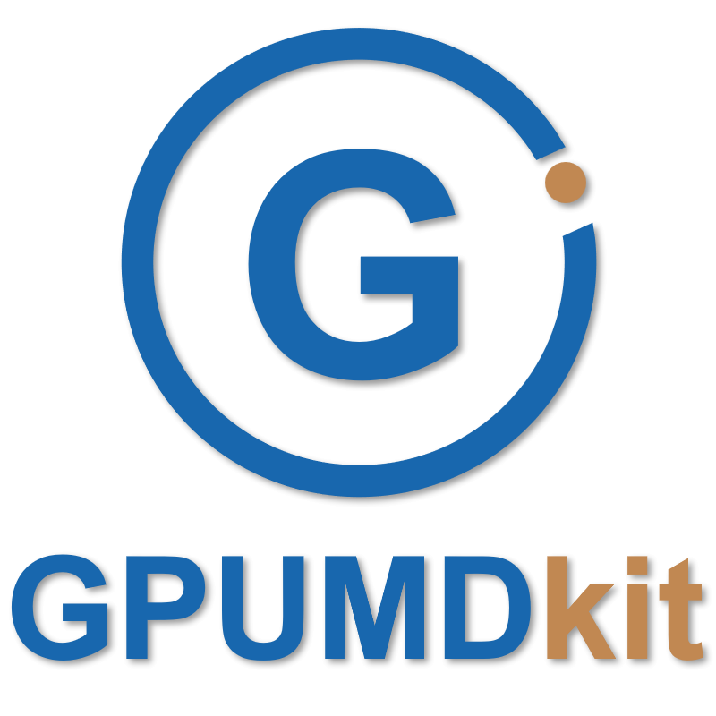

<p align="center">
  
</p>
<p align="center">
  <strong>English</strong>
  &nbsp;·&nbsp;
  <a href="./docs/README_zh-CN.md">简体中文</a>
  &nbsp;·&nbsp;
  <a href="https://gpumdkit.cn/">Website</a> &nbsp;·&nbsp;
  <a href="https://gpumdkit.cn/htmls/index.html">Documentation</a>
  &nbsp;·&nbsp;
  <a href="https://gpumdkit.cn/gallery.html">Gallery</a>
  &nbsp;
</p>
<p align="center">
  <a href="https://github.com/zhyan0603/GPUMDkit/releases"></a>
  <a href="https://github.com/zhyan0603/GPUMDkit/blob/main/LICENCE"></a>
  <a href="https://github.com/zhyan0603/GPUMDkit/stargazers"></a>
  
  <a href="https://github.com/zhyan0603/GPUMDkit/graphs/contributors"></a>
</p>
<p style="text-align: justify;"><strong>GPUMDkit</strong> is a toolkit for the GPUMD (<em>Graphics Processing Units Molecular Dynamics</em>) and NEP (<em>neuroevolution potential</em>) programs. It provides a unified command-line entry point for common scripts, format conversion, structure sampling, NEP data preparation, analysis, and visualization.</p>

## Features
- **Data Preparation**: Convert, label, sample, split, filter, and inspect atomistic datasets.
- **Workflow Automation**: Prepare batch DFT/MD calculations and active-learning workflows.
- **Calculation and Analysis**: Calculate and analyze structural, transport, and NEP-related properties.
- **Visualization and Post-processing**: Visualize NEP training, molecular dynamics, diffusion, and thermal-transport results.
- **Flexible Interface**: Use an interactive menu or direct command-line options.

## Installation

### Conda (Recommended)

```bash
conda create -n gpumdkit -c gpumdkit -c conda-forge gpumdkit
conda activate gpumdkit
```

Some features require optional packages:

```bash
pip install neptrain calorine
```

### From Source

```bash
git clone https://github.com/zhyan0603/GPUMDkit.git
cd GPUMDkit
source ./install.sh
```

### GPUMDkit Agent Skill

GPUMDkit includes English and Chinese Agent Skills for AI-assisted GPUMDkit,
GPUMD, and NEP workflows. After installation, run:

```bash
gpumdkit.sh -skill
```

Then ask your agent to follow the printed instructions and install the relevant
skills globally. Global installation is the normal recommendation; if the
installation scope is not specified, the agent should ask whether to use the
global or current-project directory before creating links.

## Update

### Conda Installation

If `GPUMDkit` was installed with Conda, update it using:

```bash
conda activate gpumdkit
conda update -c gpumdkit -c conda-forge gpumdkit
```

Optional dependencies installed with pip can be updated separately if needed:

```bash
pip install --upgrade neptrain calorine
```

### Source Installation

If `GPUMDkit` was installed from the source repository, run:

```bash
gpumdkit.sh -update
```

This command checks the currently installed Git branch and pulls the latest updates from the same branch.

Alternatively, download the latest source archive manually:

```bash
wget https://github.com/zhyan0603/GPUMDkit/archive/refs/heads/main.zip
```

## Usage

For a guided first run, see the [Quick Start](./docs/tutorials/en/quick_start.md).
Use the [Command Reference](./docs/tutorials/en/command_reference.md) when you
already know the task and need exact syntax.

### Interactive mode

Run the menu and select a numbered module:

```bash
gpumdkit.sh
```

### Command-line mode

Use direct options for repeatable tasks:

```bash
gpumdkit.sh -h
gpumdkit.sh -doctor
gpumdkit.sh -<option> [args...]
```

Common examples:

```bash
gpumdkit.sh -pos2exyz POSCAR model.xyz
gpumdkit.sh -plt train
gpumdkit.sh -plt thermo save
```

Use `gpumdkit.sh -plt -h` to list plot types and `gpumdkit.sh -calc -h` to
list calculator commands. For commands that expose option help, append `-h` to
the command. The tutorials document required inputs, outputs, and scientific
assumptions for each module.

#### Custom Commands

`GPUMDkit` now supports custom commands via `~/.gpumdkit.in`.

You can add your own shortcuts (e.g., `gpumdkit.sh -yourcommand`) by defining functions in this file. This allows you to extend `GPUMDkit` with personal scripts. See [custom command documentation](https://gpumdkit.cn/) for details.

#### Tab Completion Support

`gpumdkit.sh` provides optional Bash `Tab` completion to enhance the command-line experience. This feature allows you to auto-complete primary options (e.g., `-h`, `-plt`, `-calc`) and their secondary parameters (e.g., `thermo`, `train`) by pressing the `Tab` key.

##### Usage Examples

- Type `gpumdkit.sh -<Tab>` to see all available options.
- Type `gpumdkit.sh -plt <Tab>` to list plotting sub-options like `thermo`, `train`, etc.
- Type `gpumdkit.sh -time <Tab>` to see calculator options like `gpumd`, `nep`.

## Join Us 

We’d love your help to improve **GPUMDkit**! Contribute by:

- Adding Python/Shell scripts via [Pull Requests](https://github.com/zhyan0603/GPUMDkit/pulls).
- Report issues or suggest features via [issues](https://github.com/zhyan0603/GPUMDkit/issues).
- Contacting me at [yanzihan@westlake.edu.cn](mailto:yanzihan@westlake.edu.cn).

Also, welcome to join our QQ group ([825696376](https://qun.qq.com/universal-share/share?ac=1&authKey=buBNi1ADDzIFF2oZ1yA5FywG3LA9EL9yKZmb%2BN2MMz7nNuuxTas54wH7BgPEqP0s&busi_data=eyJncm91cENvZGUiOiI4MjU2OTYzNzYiLCJ0b2tlbiI6IlRxL1RLTDlOK3U2ekRSUXJ1TkNTUWd3ODNVV3BrdG9HN2lWWmJKMHAraGlDNzBZWFFyRUY2dUlSaW8rbUd4MisiLCJ1aW4iOiIxNDg5NjQ3MTc5In0%3D&data=fa4zSsT_IdI4ftCT_wwpytYHf--TaTB35lH0Jac5JHVpYoyXw3_3bZ1l1NZejsOZnGJku5u3BCbf5_bgrCkhZg&svctype=4&tempid=h5_group_info)). Let’s build something useful together! 🌟

## Citation

**GPUMDkit** is an open-source tool freely available for everyone. If you find it helpful in your research or workflow, please ⭐ [star us on GitHub](https://github.com/zhyan0603/GPUMDkit). Additionally, if GPUMDkit contributes to your published work, please cite our paper:

> Z. Yan\*, D. Li, X. Wu, Z. Liu, C. Hua, B. Situ, H. Yang, S. Tang, B. Tang, Z. Wang, S. Yi, H. Wang, D. Huang, K. Li, Q. Guo, Z. Chen, K. Xu, Y. Wang, Z. Wang, G. Tang, S. Liu, Z. Fan, and Y. Zhu\*. **GPUMDkit: A User-Friendly Toolkit for GPUMD and NEP**. [MGE Advances, 2026, 4, e70074](https://doi.org/10.1002/mgea.70074).

In your manuscript you may write something like:

> Data processing and figure generation were performed using GPUMDkit [x].
