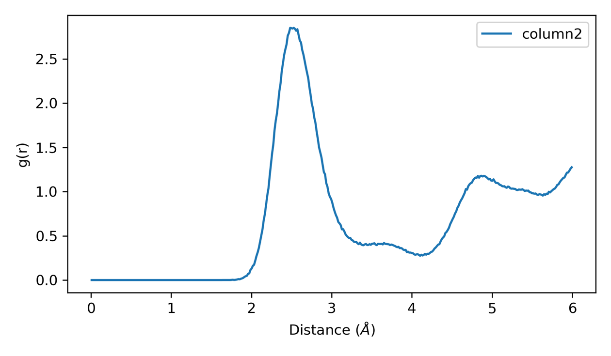

## Plot Scripts

This folder contains Python scripts for visualization of data generated by `GPUMD` and `NEP`.

- `plt_nep_thermo.py`: Python script to visualize temperature, pressure, kinetic energy, potential energy, lattice parameters, volume, and interaxial angles evolution over simulation time based on data from `thermo.out`.

  

- `plt_nep_train_results.py`: Python script to visualize parameters during `NEP` training and comparison of `DFT` and `NEP` predictions for `energy`, `force`, `stress`, etc.

  <div align="center">
      
  </div>

- `plt_nep_train_test.py`: Python script to visualize the parity plot of `*_train.out` and `*_test.out` .

  

- `plt_nep_prediction_results.py`: Python script to visualize predictions during the `NEP` prediction process.

  

- `plt_msd.py`: Python script to visualize the mean-square displacement ([MSD](https://gpumd.org/glossary.html#term-MSD)) from `msd.out` file.

  <div align="center">
      
  </div>

- `plt_sdc.py`: Python script to visualize the self diffusion coefficient ([SDC](https://gpumd.org/glossary.html#term-SDC)) from `sdc.out` file.

  <div align="center">
      
  </div>

- `plt_rdf.py`: Python script to visualize the RDF from `rdf.out` file.

  - `python plt_rdf.py [save]` will plot all columns in the `rdf.out`.

    

  - `python plt_rdf.py [column] [save]` will plot the specified column in the `rdf.out`.

    <div align="center">
        
    </div>

- `plt_nep_restart.py`: Python script to visualize the parameters in `nep.restart` file.

  <div align="center">
      
  </div>

`thermo.png`, `train.png`, `train_test.png`, `prediction.png`, `msd.png`, `nep_restart.png`, `rdf.png`: Example output plots generated by the scripts.


#### Usage:

You can use `gpumdkit.sh` for simplified execution:

```bash
gpumdkit.sh -plt thermo/train/prediction/train_test/msd/sdc/rdf/vac/restart [save]
```

Replace `thermo`, `train`, `prediction`, `train_test`, `msd`, `rdf`,`vac`, `restart` with the desired script keyword.

The optional `save` argument will save the plot as a `PNG` file; omitting it will display the plot using `plt.show()`.

#### Example:

To visualize `thermo` evolution from `thermo.out` :

```sh
gpumdkit.sh -plt thermo
```

To save the plot of `thermo` evolution from `thermo.out` :

```sh
gpumdkit.sh -plt thermo save
```


---

Thank you for using `GPUMDkit`! If you have any questions or need further assistance, feel free to open an issue on our GitHub repository or contact Zihan YAN (yanzihan@westlake.edu.cn).
