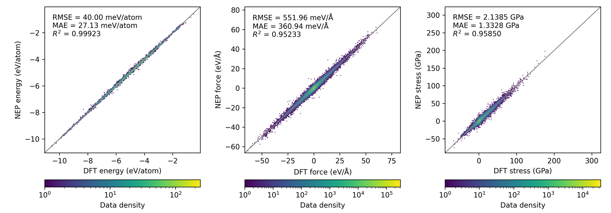
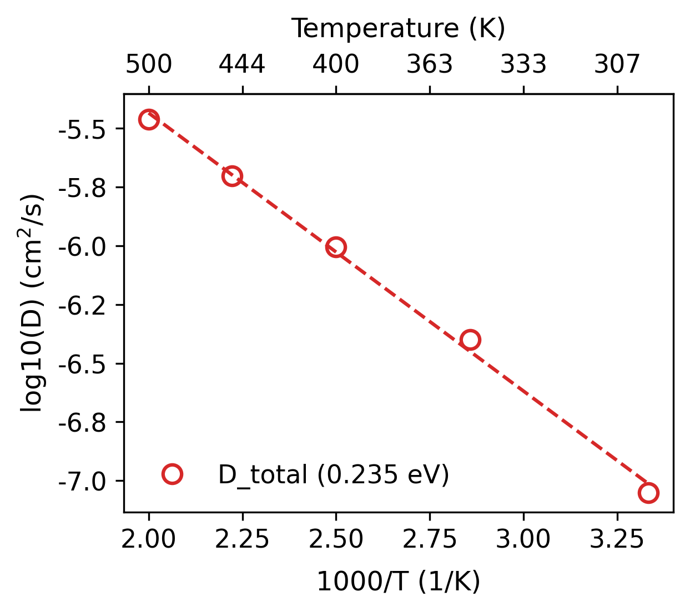
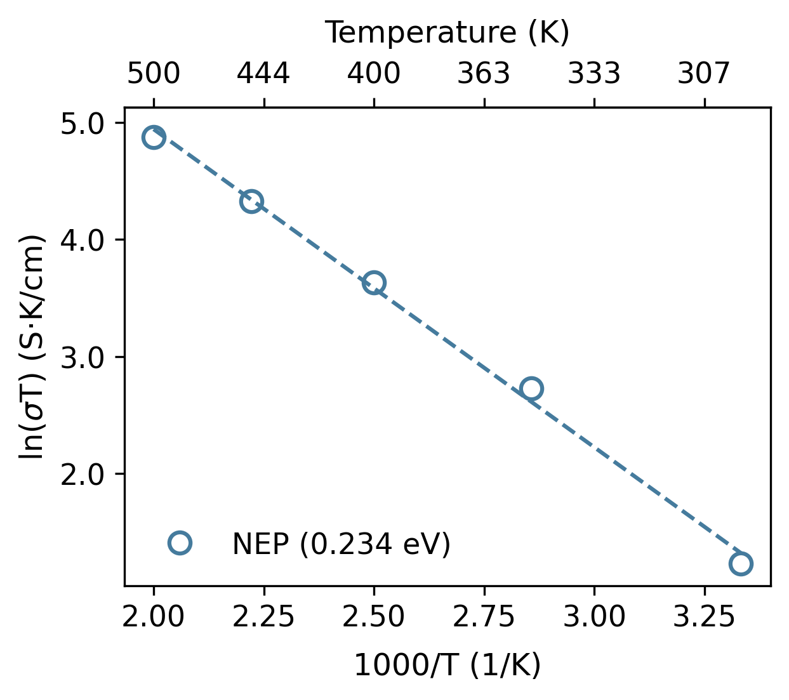
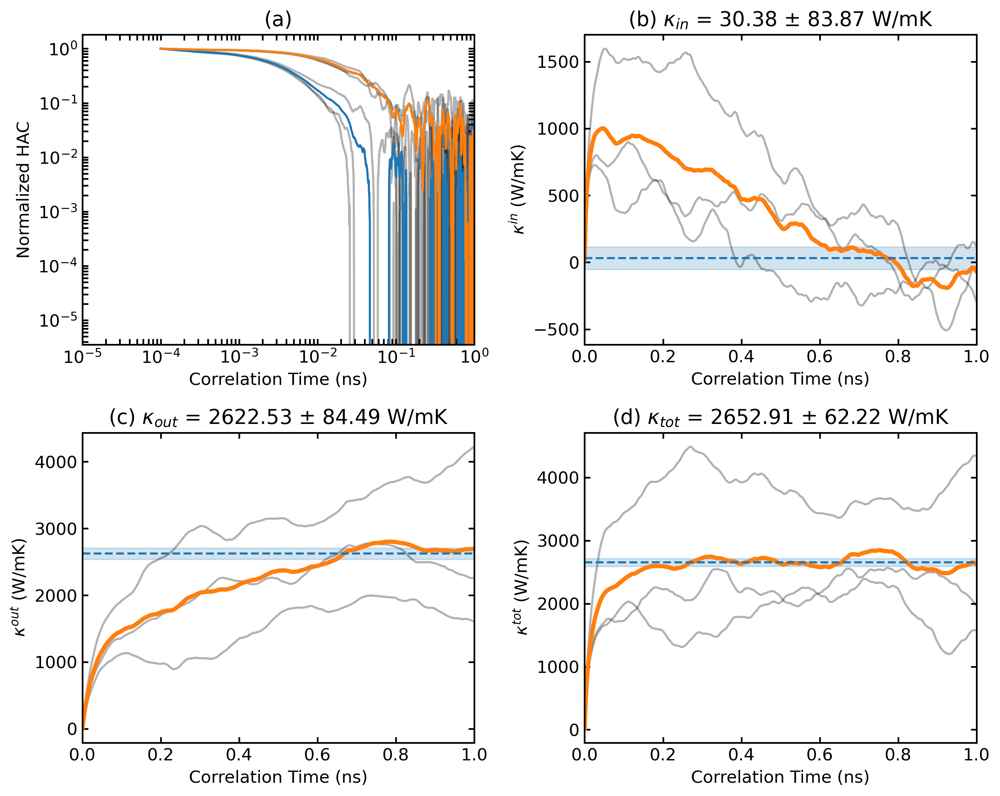
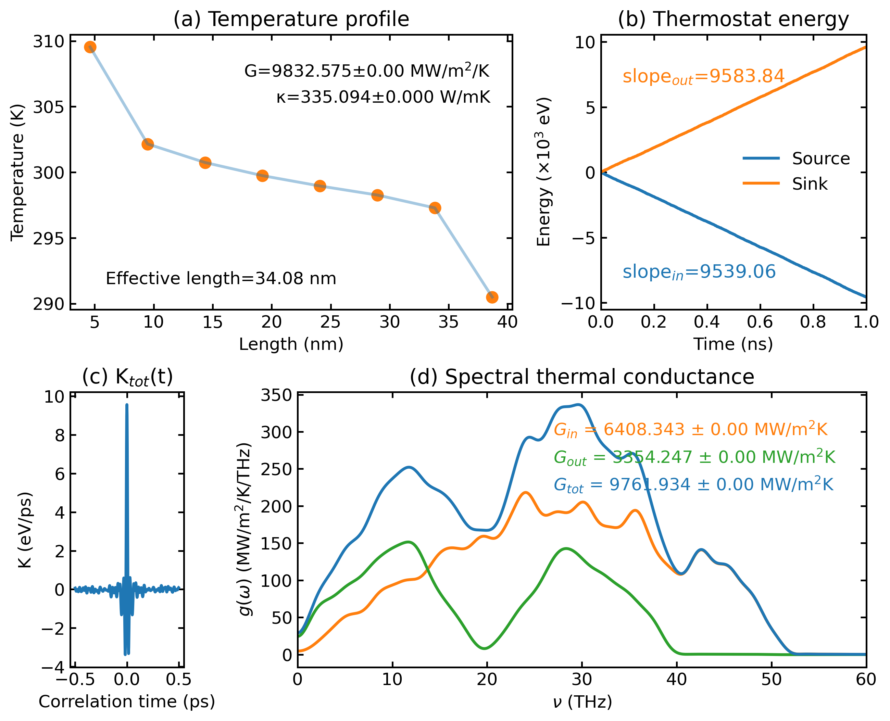
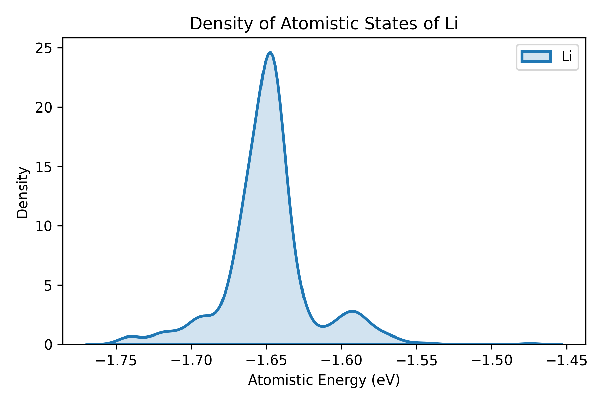

<div align="center">
  <h1>📊 Plot Scripts</h1>
    <p style="text-align: justify;">This directory (Scripts/plt_scripts/) contains Python scripts for comprehensive visualization of data generated by <strong>GPUMD</strong> and <strong>NEP</strong>. These plotting tools help analyze molecular dynamics simulations, NEP training results, and various material properties.</p>
</div>

**Script Location:** `Scripts/plt_scripts/`

GPUMDkit provides comprehensive visualization tools for GPUMD and NEP data.

## Command-Line Mode

```bash
gpumdkit.sh -plt <plot_type> [options]
```

For a complete list:
```bash
gpumdkit.sh -plt -h

+=====================================================================================================+
|                              GPUMDkit 1.4.2 (dev) (2025-12-17) Plotting Usage                       |
+=============================================== Plot Types ==========================================+
| thermo          Plot thermo info                   | train          Plot NEP train results          |
| prediction      Plot NEP prediction results        | train_test     Plot NEP train and test results |
| msd             Plot mean square displacement      | msd_conv       Plot the convergence of MSD     |
| msd_all         Plot MSD of all species            | sdc            Plot self diffusion coefficient |
| rdf             Plot radial distribution function  | vac            Plot velocity autocorrelation   |
| restart         Plot parameters in nep.restart     | dimer          Plot dimer plot                 |
| force_errors    Plot force errors                  | des            Plot descriptors                |
| charge          Plot charge distribution           | lr             Plot learning rate              |
| doas            Plot density of atomistic states   | arrhenius_d    Plot Arrhenius diffusivity      |
| arrhenius_sigma Plot Arrhenius sigma               | net_force      Plot net force distribution     |
| emd             Plot EMD results                   | nemd           Plot NEMD results               |
| hnemd           Plot HNEMD results                 |                                                |
+=====================================================================================================+
| For detailed usage and examples, use: gpumdkit.sh -plt <plot_type> -h                               |
+=====================================================================================================+
 See the codes in plt_scripts for more details
 Code path: /d/Westlake/GPUMD/Gpumdkit/Scripts/plt_scripts
```

---

## Script Categories

### 🔬 NEP Training & Prediction

Scripts for monitoring and analyzing NEP model training and predictions.

#### plt_train.py

Visualizes NEP training progress including loss curves, RMSE evolution, and parity plots comparing DFT vs NEP predictions for energy, forces, and stresses.

**Input File:** `loss.out`, `energy_train.out`, `force_train.out`, `virial_train.out`

**Usage:**
```bash
gpumdkit.sh -plt train
```

<div align="center">
    
</div>


---

#### plt_prediction.py

Visualizes NEP prediction results.

**Input Files:** `energy_test.out`, `force_test.out`, `virial_test.out`

**Usage:**

```bash
gpumdkit.sh -plt prediction
gpumdkit.sh -plt test             # Alternative command
```


---

#### plt_train_test.py

Creates combined parity plots for both training and testing datasets.

**Input Files:** `*_train.out`, `*_test.out`

**Usage:**

```bash
gpumdkit.sh -plt train_test  
```


---

#### plt_parity_density.py

Generates density-based parity plots for energies, forces, and stresses, useful for large datasets.

**Input Files:** `energy_train.out`, `force_train.out`, `virial_train.out`

**Usage:**

```bash
gpumdkit.sh -plt parity_density
```



---

#### plt_force_errors.py

Plots force error evaluation metrics as proposed in [Liu et al.](https://doi.org/10.1038/s41524-023-01123-3).

**Input File:** `force_train.out`

**Usage:**
```bash
gpumdkit.sh -plt force_errors
```

**Metrics Displayed:**
- Force magnitude errors (delta_F)
- Force angle errors  (delta_theta)
- Distribution of errors


---

#### plt_learning_rate.py

Visualizes learning rate during `gnep` training.

**Input File:** `loss.out` 

**Usage:**

```bash
gpumdkit.sh -plt lr 
```

**Use Case:** Monitor learning rate decay. 

**Note:** this is only for the `gnep` training process.

---

#### plt_nep_restart.py

Visualizes parameters stored in `nep.restart` file.

**Input File:** `nep.restart`

**Usage:**

```bash
gpumdkit.sh -plt restart    
```

<div align="center">
    
</div>


---

### 🌡️ Thermodynamic Properties

Scripts for visualizing thermo info from GPUMD simulations.

#### plt_thermo.py

Primary script for comprehensive thermodynamic property visualization.

**Input File:** `thermo.out`

**Usage:**

```bash
gpumdkit.sh -plt thermo  
```


---

#### plt_thermo2.py & plt_thermo3.py

Alternative thermodynamic visualization (different styles).

**Usage:**

```bash
gpumdkit.sh -plt thermo2 
gpumdkit.sh -plt thermo3
```

---

### 🔄 Transport Properties

Scripts for analyzing diffusion, ionic conductivity, and thermal transport, etc.

#### plt_msd.py

Plots mean square displacement (MSD) for all directions.

**Input File:** `msd.out`

**Usage:**

```bash
gpumdkit.sh -plt msd
```

<div align="center">
    
</div>


---

#### plt_msd_all.py

Plots MSD for all atomic species separately when using `all_groups` in GPUMD.

**Input File:** `msd.out` (computed with `all_groups` option)

**Usage:**
```bash
gpumdkit.sh -plt msd_all <species1> <species2> ...
gpumdkit.sh -plt msd_all Li P S
```

**Requirements:** Must use `all_groups` in the `compute_msd` command in `run.in`.

<div align="center">
    
</div>


---

#### plt_msd_convergence_check.py

Checks convergence of MSD calculations across different time windows.

**Input File:** `msd.out` (computed with `save_every` option)

**Usage:**

```bash
gpumdkit.sh -plt msd_conv
```

**Requirements:** Use `save_every` in the `compute_msd` command.

**Purpose:** Verify MSD has converged sufficiently for accurate diffusion coefficient calculation.

<div align="center">
    
</div>


---

#### plt_sdc.py

Plots self-diffusion coefficient (SDC) vs time.

**Input File:** `msd.out`

**Usage:**

```bash
gpumdkit.sh -plt sdc
```

<div align="center">
    
</div>


---

#### plt_arrhenius_d.py

Creates Arrhenius plot for diffusivity (log10 D vs 1000/T).

**Input Files:** `*K/msd.out` files

**Usage:**

```bash
gpumdkit.sh -plt arrhenius_d
gpumdkit.sh -plt D  # Alternative command
```

<div align="center">
    
</div>


**Output:**

```
T: 300K, D_total: 1.001e-07 cm2/s
T: 350K, D_total: 4.184e-07 cm2/s
T: 400K, D_total: 1.027e-06 cm2/s
T: 450K, D_total: 2.069e-06 cm2/s
T: 500K, D_total: 3.563e-06 cm2/s
Ea: 0.230 eV
```

---

#### plt_arrhenius_sigma.py

Creates Arrhenius plot for ionic conductivity (ln(σ·T) vs 1000/T).

**Input Files:** `*K/{model.xyz, run.in, thermo.out, msd.out}`

**Usage:**

```bash
gpumdkit.sh -plt arrhenius_sigma
gpumdkit.sh -plt sigma         # Alternative command
```

<div align="center">
    
</div>


**Output:**

```
[Note] No run.in file found, assuming no replication

Conductivity Data:
T (K)  Sigma (S/cm)    Sigma·T (K·S/cm)
------------------------------------
300    1.141e-02       3.422e+00
350    4.377e-02       1.532e+01
400    9.470e-02       3.788e+01
450    1.688e-01       7.595e+01
500    2.625e-01       1.312e+02
------------------------------------

msd, Ea: 0.234 eV
at 300K, LGPS: Sigma = 1.250e-02 S/cm
```

---

#### plt_emd.py

Analyzes and plots thermal conductivity from equilibrium molecular dynamics (EMD).

**Usage:**

```bash
gpumdkit.sh -plt emd <direction>
gpumdkit.sh -plt emd x # for x direction
```

<div align="center">
    
</div>


---

#### plt_nemd.py

Visualizes non-equilibrium molecular dynamics (NEMD) thermal transport properties.

**Usage:**

```bash
gpumdkit.sh -plt nemd [real_length] [scale_eff_size] [cutoff_freq] [save]
```

**Params:**

```
real_length   : Real length of heat tranfer zone in nm (set to 'Auto', with auto-calculation)
scale_eff_size: Optional, Scale factor for effective cross-sectional area (default: 1)
               • For 3D bulk systems: use 1
               • For low-dimensional systems with vacuum layer: S_box / S_eff
                 - S_box: box area perpendicular to heat transfer direction
                 - S_eff: real or effective area of the system
cutoff_freq   : Optional, Cutoff frequency for SHC calculation in THz (default: 60)
save          : Optional, save the plot as 'nemd.png'
!!! Note !!!  : If no SHC data, set [scale_eff_size] and [cutoff_freq] to any number as placeholders when using 'save'.
```

<div align="center">
    
</div>


---

#### plt_hnemd.py

Plots homogeneous non-equilibrium molecular dynamics (HNEMD) results.

**Usage:**

```bash
gpumdkit.sh -plt hnemd [scale_eff_size] [cutoff_freq] [save]
```

**Params:**

```
scale_eff_size: Optional, Scale factor for effective cross-sectional area (default: 1)
               • For 3D bulk systems: use 1
               • For low-dimensional systems with vacuum layer: S_box / S_eff
                 - S_box: box area perpendicular to heat transfer direction
                 - S_eff: real or effective area of the system
cutoff_freq   : Optional, Cutoff frequency for SHC calculation in THz (default: 60)
save          : Optional, save the plot as 'hnemd.png'
!!! Note !!!  : If no SHC data, set [scale_eff_size] and [cutoff_freq] to any number as placeholders when using 'save'.
```


<div align="center">
    
</div>


---

### 📐 Structural Analysis

Scripts for analyzing atomic structure and distributions.

#### plt_rdf.py

Plots radial distribution function (RDF) showing pair correlations.

**Input File:** `rdf.out`

**Usage:**

```bash
# Plot all RDF pairs
gpumdkit.sh -plt rdf               # Display all

# Plot specific column
gpumdkit.sh -plt rdf <column>      # Display specific pair
```

**Full RDF output:**


**Single pair RDF:**
<div align="center">
    
</div>


---

#### plt_charge.py

Plots charge distribution in `charge_train.out` from `qNEP` model.

**Input File:** `charge_train.out`

**Usage:**

```bash
gpumdkit.sh -plt charge
```

**Important:** Ensure consistency between training set and charge output atom ordering. Use full batch training or run prediction step first.

<div align="center">
    
</div>


---

### 🧬 Extra Analysis

Specialized scripts for some analysis.

#### plt_descriptors.py

Visualizes high-dimensional descriptors using dimensionality reduction (PCA/UMAP).

**Input Files:** `descriptors.npy` (generated by `calc_descriptors.py`)

**Usage:**

```bash
# First generate descriptors
gpumdkit.sh -calc des train.xyz descriptors.npy nep.txt Li

# Then plot
gpumdkit.sh -plt des <method>
```

**Methods:**
- `pca` - Principal Component Analysis
- `umap` - Uniform Manifold Approximation and Projection

You need some additional modifications to get the following plot, see the [code]([SourceFiles/NEP-ZBL/PCA_UMAP at main · zhyan0603/SourceFiles](https://github.com/zhyan0603/SourceFiles/tree/main/NEP-ZBL/PCA_UMAP)) here.

<div align="center">
    
</div>


---

#### plt_descriptors_compare.py

Compares descriptors from multiple training sets or models.

---

#### plt_dimer.py

Plots dimer interaction curves. Two atoms are placed in a cubic box with the length of 30 angstrom. And then, the potential energy and the force will be calculated as a function of dimer distance.

**Usage:**
```bash
gpumdkit.sh -plt dimer <element1> <element2> <nepmodel>
```

**Example:**
```bash
gpumdkit.sh -plt dimer Li Li nep.txt
```

<div align="center">
    
    
</div>


**Reference:** [arXiv:2504.15925](https://doi.org/10.48550/arXiv.2504.15925)

---

#### plt_doas.py

Plots density of atomistic states (DOAS) proposed by [Wang et al.](https://doi.org/10.1002/anie.202215544).

**Input Files:** `doas.out` file calculated by `gpumdkit.sh -calc doas`

**Usage:**

```bash
gpumdkit.sh -plt doas <doas.out> <species>
gpumdkit.sh -plt doas doas.out Li
```

<div align="center">
    
</div>


---

#### plt_net_force.py

Plots distribution of net forces on structures, useful for identifying problematic configurations.

**Usage:**
```bash
gpumdkit.sh -plt net_force <extxyzfile>
gpumdkit.sh -plt net_force train.xyz
```

**Reference:** [arXiv:2510.19774](https://arxiv.org/abs/2510.19774)

<div align="center">
    
</div>


---

### Quick Reference Table

| Command | Input File(s) | Description |
|---------|---------------|-------------|
| `thermo` | `thermo.out` | Thermodynamic properties evolution |
| `train` | `loss.out`, `*_train.out` | NEP training plot |
| `prediction` | `*_test.out` | NEP prediction plot |
| `train_test` | `*_train.out`, `*_test.out` | parity plots of train&test |
| `msd` | `msd.out` | Mean square displacement |
| `sdc` | `msd.out` | Self-diffusion coefficient |
| `rdf` | `rdf.out` | Radial distribution function |
| `vac` | `vac.out` | Velocity autocorrelation |
| `charge` | `charge_train.out` | Charge distribution |
| `doas` | DOAS files | Density of atomistic states |
| `des` | `descriptors.npy` | Descriptor visualization |
| `dimer` | Needs nep model | Dimer interaction curve |
| `force_errors` | `force_train.out` | Force error metrics |
| `lr` | `loss.out` from `gnep` | Learning rate |
| `restart` | `nep.restart` from `nep` | Restart file parameters |
| `net_force` | train.xyz | Net force distribution |
| `emd` | EMD outputs | EMD thermal conductivity |
| `nemd` | NEMD outputs | NEMD thermal transport |
| `hnemd` | HNEMD outputs | HNEMD thermal transport |
| `arrhenius_d` | Multiple MSD | Arrhenius diffusivity |
| `arrhenius_sigma` | Conductivity data | Arrhenius conductivity |

## Contributing

To add new plotting scripts:

1. **Create script** following naming conventions
2. **Add documentation** to this README
5. **Update gpumdkit.sh** to integrate new plot type

See [CONTRIBUTING.md](Contributing.md) for detailed guidelines.

---

Thank you for using GPUMDkit! If you have any questions, need further assistance, or want to contribute new plotting scripts, feel free to open an issue on our [GitHub repository](https://github.com/zhyan0603/GPUMDkit/issues) or contact Zihan YAN (yanzihan@westlake.edu.cn).
