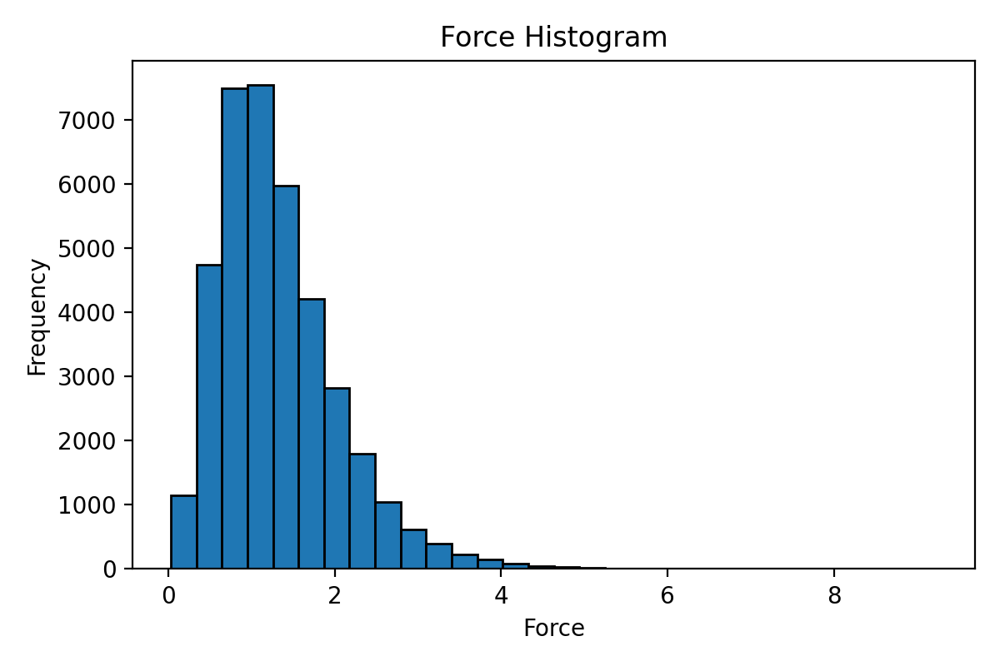

<div align="center">
  <h1>🔍 分析工具</h1>
  <p style="text-align: justify;">分析脚本为 extxyz 数据集提供结构统计、距离检查、过滤、成分分析、异常检测和时间估算功能。</p>
</div>

## 功能简介

本模块帮助你检查、过滤和验证结构数据集。可以检查成分、分析性质范围、检测短距离接触、按各种条件过滤结构、查找 NEP 训练数据中的异常值，以及估算剩余模拟时间。

## 准备工作

**脚本位置：** `Scripts/analyzer/`

确保已安装 GPUMDkit。安装说明请参见[快速入门](快速入门.md)。

## 概览

| 任务 | 命令 | 用途 |
|------|------|------|
| 成分分析 | `gpumdkit.sh -analyze_comp train.xyz` | 按化学成分分组 |
| 化学物种 | `gpumdkit.sh -chem_species train.xyz` | 列出文件中的元素 |
| 性质范围 | `gpumdkit.sh -range train.xyz force` | 检查能量/力/virial 范围 |
| 最短距离 | `gpumdkit.sh -min_dist dump.xyz` | 快速距离检查（无 PBC） |
| 最短距离（PBC） | `gpumdkit.sh -min_dist_pbc dump.xyz` | 准确距离检查（含 PBC） |
| 电荷平衡 | `gpumdkit.sh -cbc train.xyz` | 氧化态平衡检查 |
| 距离过滤 | `gpumdkit.sh -filter_dist_pbc dump.xyz 1.0` | 移除短距离接触的结构 |
| 盒子过滤 | `gpumdkit.sh -filter_box dump.xyz 13` | 移除盒子过大的结构 |
| 性质过滤 | `gpumdkit.sh -filter_value train.xyz force 20` | 按能量/力/virial 阈值过滤 |
| 对距离范围 | `gpumdkit.sh -filter_range dump.xyz Li Li 1.8 2.0` | 按对距离提取结构 |
| 异常检测 | 菜单 502 | 查找训练集中高 RMSE 的结构 |
| 概率密度 | `gpumdkit.sh -pda <参考结构> <轨迹> <元素> <网格间距>` | 3D 概率密度分析扩散通道 |
| GPUMD 时间 | `gpumdkit.sh -time gpumd` | 估算 GPUMD 剩余运行时间 |
| NEP 时间 | `gpumdkit.sh -time nep` | 估算 NEP 剩余训练时间 |

---

## 交互模式

打开 GPUMDkit 并选择 `5) Analyzer`：

```bash
gpumdkit.sh
```

分析工具菜单如下：

```text
+------------------------------------------------------+
|                    ANALYZER TOOLS                    |
+------------------------------------------------------+
| 501) Analyze composition of extxyz                   |
| 502) Find outliers of extxyz                         |
| 503) Analyze chemical species of extxyz              |
| 504) Check charge balance of extxyz                  |
| 505) Analyze energy/force/virial range               |
| 506) Filter structures by minimum distance           |
| 507) Get minimum interatomic distance                |
| 508) Probability density analysis                    |
+------------------------------------------------------+
| 000) Return to the main menu                         |
+------------------------------------------------------+
Input the function number:
```

大多数分析功能也提供直接 CLI 调用方式，概览表和后续小节中列出了常用命令。

---

## 成分分析

`analyze_composition.py` 分析 extxyz 文件的成分，并允许导出子集。

**功能：** 按化学成分对结构分组，并显示每种成分的结构数量。可以按成分导出子集。

**命令行模式：**

```bash
gpumdkit.sh -analyze_comp train.xyz
```

**交互模式：** 在分析工具菜单中选择 `501`。

**输出示例：**

```text
Index    Compositions           N atoms      Count
---------------------------------------------------
1        Li56O96Zr16La24        192          51
---------------------------------------------------
Enter index to export (e.g., '1,2', '2-3', 'all'), or press Enter to skip:
```

当 `train.xyz` 包含不同体系或不同尺寸的结构时很有用。可以从交互提示中按成分导出子集。

---

## 化学物种

`analyze_chem_species.py` 列出 extxyz 文件中所有唯一的化学物种。

**输入文件：** `train.xyz`（extxyz 格式）

```bash
gpumdkit.sh -chem_species train.xyz
```

---

## 性质范围分析

`energy_force_virial_analyzer.py` 计算并可视化 extxyz 文件中性质的范围。

**输入文件：** `train.xyz`（extxyz 格式）

**支持的性质：** `energy`、`force`、`virial`

```bash
gpumdkit.sh -range train.xyz force
gpumdkit.sh -range train.xyz energy
gpumdkit.sh -range train.xyz virial
gpumdkit.sh -range train.xyz force hist    # 显示直方图
```

**输出示例：**

```text
Force range: 0.03210566767721861 to 9.230115912468435
```

使用 `hist` 选项：

<div align="center">
  
</div>

---

## 最短距离检查

### 无 PBC（快速）

`get_min_dist.py` 计算不考虑周期性边界条件的最短原子间距。速度快，但对周期性体系可能不准确。

**功能：** 报告每帧中每对元素之间的最短距离，忽略周期性边界条件。

**命令行模式：**

```bash
gpumdkit.sh -min_dist dump.xyz
```

**交互模式：** 在分析工具菜单中选择 `507`。

**输出示例：**

```text
+---------------------------+
|   PBC ignored for speed   |
| use -min_dist_pbc for PBC |
+---------------------------+
Minimum interatomic distances:
+---------------------------+
| Atom Pair |  Distance (Å) |
+---------------------------+
|   Li-Li   |     1.696     |
|   Li-O    |     1.587     |
|   O-O     |     2.480     |
+---------------------------+
Overall min_distance: 1.587 Å
```

**说明：** 用于快速检查。对于周期性体系，建议使用 `-min_dist_pbc` 获得准确结果。

### 含 PBC（准确）

`get_min_dist_pbc.py` 计算考虑周期性边界条件的最短原子间距。

**功能：** 报告每对元素之间的最短距离，考虑周期性边界条件。

**命令行模式：**

```bash
gpumdkit.sh -min_dist_pbc dump.xyz
```

**交互模式：** 在分析工具菜单中选择 `507`，当提示是否考虑 PBC 时输入 `y`。

**输出示例：**

```text
Minimum interatomic distances (with PBC):
+---------------------------+
| Atom Pair |  Distance (Å) |
+---------------------------+
|   Li-Li   |     1.696     |
|   Li-O    |     1.587     |
|   O-O     |     2.355     |
+---------------------------+
Overall min_distance: 1.587 Å
```

---

## 结构过滤

### 按最短距离过滤

`filter_structures_by_distance_pbc.py` 移除任何原子间距低于阈值的结构。

**输入文件：** `dump.xyz`（extxyz 格式）

```bash
gpumdkit.sh -filter_dist_pbc dump.xyz 1.0
```

移除任何原子间距低于 `1.0 Å` 的结构。

### 按盒子大小过滤

`filter_exyz_by_box.py` 按盒子边长过滤结构。

**输入文件：** `dump.xyz`（extxyz 格式）

```bash
gpumdkit.sh -filter_box dump.xyz 13
```

保留所有盒子边长低于 `13 Å` 的结构。

### 按性质值过滤

`filter_exyz_by_value.py` 按能量、力或 virial 阈值过滤结构。

**输入文件：** `train.xyz`（extxyz 格式）

**支持的性质：** `energy`、`force`、`virial`

```bash
gpumdkit.sh -filter_value train.xyz force 20
gpumdkit.sh -filter_value train.xyz energy 5
```

过滤掉力分量超过 `20 eV/Å`（或能量超过 `5 eV/atom`）的结构。

### 按对距离范围过滤

`filter_dist_range.py` 提取特定元素对距离在给定范围内的结构。

**输入文件：** `dump.xyz`（extxyz 格式）

```bash
gpumdkit.sh -filter_range dump.xyz Li Li 1.8 2.0
```

提取 Li-Li 最短距离在 `1.8 Å` 到 `2.0 Å` 之间的结构。输出：`filtered_Li_Li_1.8_2.0.xyz`。

---

## 电荷平衡检查

`charge_balance_check.py` 检查结构的氧化态平衡。

**输入文件：** `train.xyz`（extxyz 格式）

```bash
gpumdkit.sh -cbc train.xyz
```

**输出文件：**

- `balanced.xyz` — 电荷平衡的结构
- `unbalanced.xyz` — 电荷不平衡的结构
- `indices.txt` — 平衡结构的索引

适用于具有明确氧化态的体系。

---

## 异常检测

`find_outliers.py` 基于能量、力和应力的 RMSE 阈值查找 NEP 训练数据中的异常结构。

**输入文件：** `energy_train.out`、`force_train.out`、`stress_train.out`、`train.xyz`

这些文件在 NEP 训练过程中生成。脚本比较 DFT 与 NEP 的预测，识别误差较大的结构。

```bash
# 交互模式
gpumdkit.sh    # 选择：5) 分析工具 → 502) 查找异常结构
```

**交互提示：**

```text
Enter energy RMSE threshold (meV/atom): 1
Enter force RMSE threshold (meV/Å): 60
Enter stress RMSE threshold (GPa): 0.03
```

**输出文件：**

- `selected.xyz` — 超过 RMSE 阈值的结构（异常值）
- `remained.xyz` — 在阈值内的结构
- `selected_remained.png` — 对比图

**用途：** NEP 训练后，用此工具识别对误差贡献最大的问题结构。移除或改进这些结构以提升训练集质量。

---

## 时间估算

### GPUMD 剩余时间

`time_consuming_gpumd.sh` 估算 GPUMD 模拟的剩余时间。

**输入文件：** `run.in`、`thermo.out`（在当前 GPUMD 工作目录中）

```bash
gpumdkit.sh -time gpumd
```

**输出示例：**

```text
----------------- System Information ----------------
total frames: 1050000
-----------------------------------------------------
Current Frame  Speed (steps/s)   Total Time       Time Left       Estimated End
-------------   -------------   -------------   -------------   -----------------
    13000          499.86         0h 35m 0s      0h 34m 34s    2025-12-27 18:12:04
    14000          199.93        1h 27m 31s      1h 26m 21s    2025-12-27 19:03:56
```

### NEP 剩余时间

`time_consuming_nep.sh` 估算 NEP 训练的剩余时间。

**输入文件：** `loss.out`（在当前 NEP 工作目录中）

```bash
gpumdkit.sh -time nep
```

**输出示例：**

```text
+-----------------+-----------+-----------------+---------------------+
|       Step      | Time Diff |    Time Left    |    Finish Time      |
+-----------------+-----------+-----------------+---------------------+
| 6700            | 1 s       | 0 h 15 m 33 s   | 2025-10-23 15:34:11 |
| 6800            | 2 s       | 0 h 31 m 4 s    | 2025-10-23 15:49:44 |
| 6900            | 2 s       | 0 h 31 m 2 s    | 2025-10-23 15:49:44 |
+-----------------+-----------+-----------------+---------------------+
```

---

## 概率密度分析

`probability_density_analysis.py` 计算移动离子的 3D 概率密度，用于扩散通道分析。

**输入文件：** 参考结构（POSCAR）、轨迹文件（extxyz）

**命令行模式：**

```bash
gpumdkit.sh -pda LLZO.vasp dump.xyz Li 0.25
```

**参数说明：**

| 参数 | 含义 |
|------|------|
| `LLZO.vasp` | 参考结构（POSCAR 格式） |
| `dump.xyz` | 轨迹文件（extxyz 格式） |
| `Li` | 目标移动离子 |
| `0.25` | 概率密度网格间距（Å） |

**输出：** `probability_density_0.25.vasp` — VASP 格式的概率密度网格，可用 VESTA 等工具可视化。

**可视化建议：**

1. 在 VESTA 中打开 `probability_density_0.25.vasp`
2. 使用 "Edit → Data → Volumetric Data" 调整等值面级别
3. 按数值对概率密度着色，以突出优选扩散路径
4. 叠加晶体结构作为参考

---

## 示例工作流

### 结构质量检查

```bash
# 1. 检查成分
gpumdkit.sh -analyze_comp train.xyz

# 2. 检查能量/力范围
gpumdkit.sh -range train.xyz force hist

# 3. 检查最短距离
gpumdkit.sh -min_dist_pbc train.xyz

# 4. 查找异常值（NEP 训练后）
# 交互：5) 分析工具 → 502
```

### 结构过滤流水线

```bash
# 1. 按最短距离过滤
gpumdkit.sh -filter_dist_pbc dump.xyz 1.0

# 2. 按盒子大小过滤
gpumdkit.sh -filter_box filtered_dist_pbc.xyz 13

# 3. 按力阈值过滤
gpumdkit.sh -filter_value filtered_box.xyz force 20
```

### 扩散通道分析

```bash
# 1. 计算概率密度
gpumdkit.sh -pda LLZO.vasp dump.xyz Li 0.25

# 2. 用 VESTA 可视化
# 打开 probability_density_0.25.vasp
```
