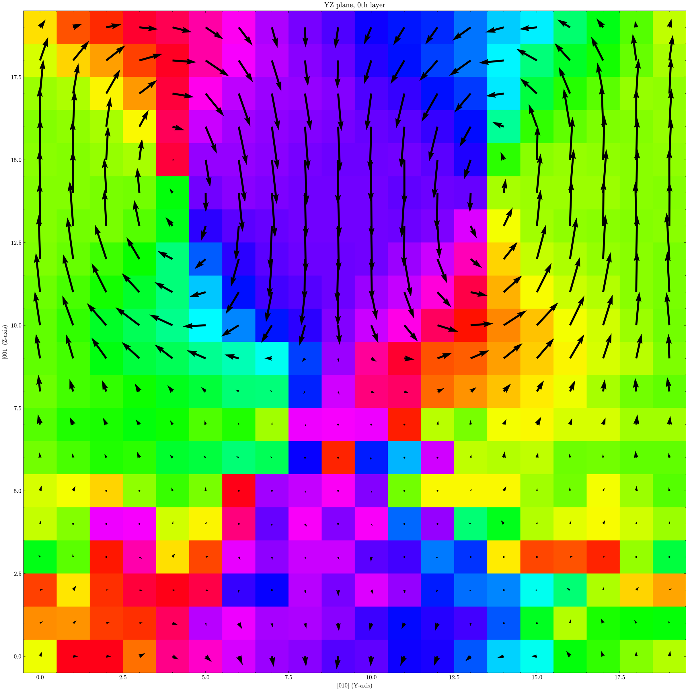
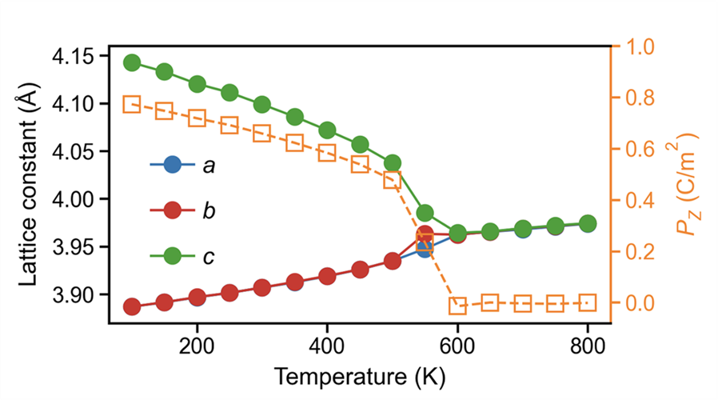
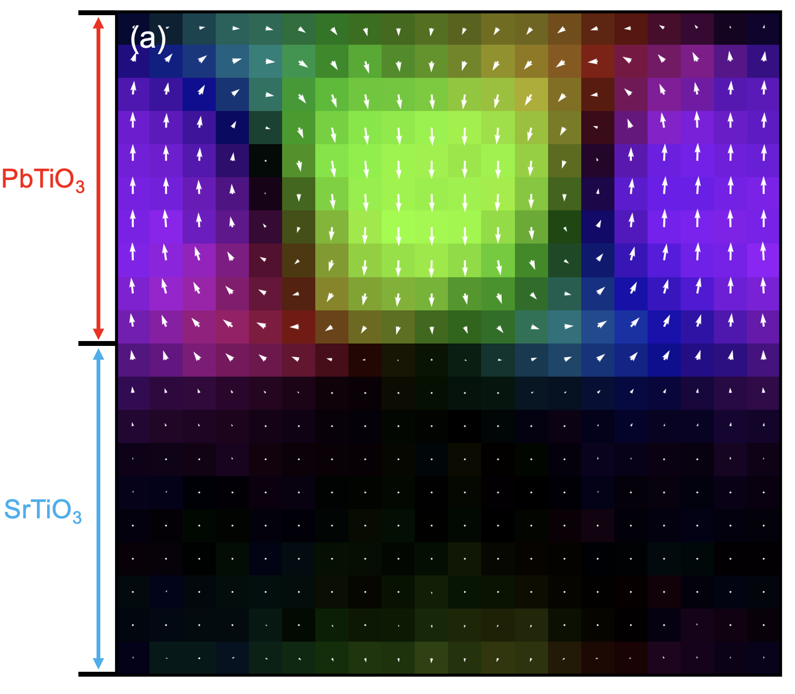

<div align="center">
  <h1>🧲 极性材料分析</h1>
  <p style="text-align: justify;">本教程介绍 GPUMDkit 中计算器选项 <code>406-410</code>，以及 <code>plane-grid</code> 绘图流程。</p>
</div>

**脚本位置：** `Scripts/calculators/` 和 `Scripts/plt_scripts/`

本教程包含通用工具和体系相关工具：

- `nlist`、`disp` 和 `avg-struct` 可广泛用于结构和轨迹分析。
- `oct-tilt` 用于八面体环境分析，需要每个中心原子周围有 6 个近邻。
- `pol-abo3` 专用于 `ABO3` 体系的极化分析。

## 概览

| 步骤 | CLI 命令 | 主要输入 | 输出 |
|------|----------|----------|------|
| 构建近邻列表 | `gpumdkit.sh -calc nlist ...` | `model.xyz` | `nl-*.dat` |
| 计算位移 | `gpumdkit.sh -calc disp ...` | 轨迹 + `nl-*.dat` | `displacements.dat` |
| 平均轨迹结构 | `gpumdkit.sh -calc avg-struct ...` | 轨迹 | 平均结构 extxyz |
| 八面体倾斜 | `gpumdkit.sh -calc oct-tilt ...` | 轨迹 + B-O 近邻列表 | 倾斜角数据表 |
| ABO3 极化 | `gpumdkit.sh -calc pol-abo3 ...` | 轨迹 + 近邻列表 | 极化数据表 |
| plane-grid 绘图 | `gpumdkit.sh -plt plane-grid ...` | 结构 + 位移数据 | 平面剖面图 |

## 依赖

这些脚本需要 `ferrodispcalc`：

```bash
pip3 install git+https://github.com/MoseyQAQ/ferrodispcalc.git
```

## 交互模式入口

选项 `406-410` 是本教程中的核心功能。下面各节会说明每个功能的用途和运行方式。

```bash
gpumdkit.sh
# 选择 4) Calculators
```

计算器菜单如下：

```text
+----------------------------------------------------------+
|                     CALCULATOR TOOLS                     |
+----------------------------------------------------------+
| 401) Calc ionic conductivity                             |
| 402) Calc properties by nep                              |
| 403) Calc descriptors of specific elements               |
| 404) Calc density of atomistic states (DOAS)             |
| 405) Calc nudged elastic band (NEB) by nep               |
| 406) Build neighbor list                                 |
| 407) Calc displacement from trajectory                   |
| 408) Calc averaged structure                             |
| 409) Calc octahedral tilt                                |
| 410) Calc polarization for ABO3                          |
| 411) Minimize structure by nep                           |
| 412) Calc mean square displacement (MSD) from trajectory |
+----------------------------------------------------------+
| 000) Return to the main menu                             |
+----------------------------------------------------------+
Input the function number:
```

完整参数说明可以通过以下命令查看：

```bash
gpumdkit.sh -calc nlist -h
gpumdkit.sh -calc disp -h
gpumdkit.sh -calc avg-struct -h
gpumdkit.sh -calc oct-tilt -h
gpumdkit.sh -calc pol-abo3 -h
gpumdkit.sh -plt plane-grid -h
```

## 406) 构建近邻列表 (`calc_neighbor_list.py`)

为指定中心元素和近邻元素构建近邻列表。

使用场景：
这通常是运行 `disp`、`oct-tilt` 和 `pol-abo3` 之前的第一步，因为这些脚本会读取 `nl-*.dat` 近邻文件。

### 用法

```bash
# 示例 1：为八面体分析构建 Ti-O 最近 6 个近邻
gpumdkit.sh -calc nlist -i model.xyz -c 4.0 -n 6 -C Ti -E O -o nl-Ti-O.dat

# 示例 2：为 A 位中心分析构建 Pb/Sr-O 最近 12 个近邻
gpumdkit.sh -calc nlist -i model.xyz -c 4.0 -n 12 -C Pb Sr -E O
```

### 参数（完整）

- `-i, --input`：
  输入结构文件。默认值：`model.xyz`。
- `-x, --index`：
  从输入文件中读取的帧编号。默认值：`0`。
- `-c, --cutoff`（必需）：
  近邻搜索截断距离，单位为 Angstrom。
- `-n, --neighbor-num`（必需）：
  每个中心原子的近邻数量。
- `-d, --defect`：
  缺陷模式。启用后，如果近邻数量不足，缺失位置会用中心原子编号填充。
- `-C, --center-elements`（必需）：
  中心元素列表。
- `-E, --neighbor-elements`（必需）：
  近邻元素列表。
- `-o, --output`：
  输出文件路径。默认值：`nl-<center>-<neighbor>.dat`。

### 输出文件

- 主要输出：近邻列表文本文件，例如 `nl-Ti-O.dat`。
- 文件是一个二维整数数组，形状为 `(n_center, neighbor_num + 1)`。每一行对应一个中心原子：第一列是中心原子编号，后续列是近邻原子编号，所有编号均为 1-based。

## 407) 从轨迹计算位移 (`calc_displacement.py`)

根据轨迹或模型结构以及近邻列表，计算局域位移矢量。

### 用法

```bash
# 示例 1：从 model.xyz 计算单帧位移
gpumdkit.sh -calc disp -i model.xyz -n nl-Ti-O.dat -o disp_model.dat

# 示例 2：使用 movie.xyz 的最后 20% 帧
gpumdkit.sh -calc disp -i movie.xyz -n nl-Ti-O.dat -l 0.2 -o displacements.dat
```

### 参数（完整）

- `-i, --input`：
  输入 xyz 文件。默认值：`model.xyz`。
- `-n, --neighbor-list`（必需）：
  由 `nlist` 生成的近邻列表文件。
- `-o, --output`：
  输出文件。默认值：`displacements.dat`。
- `-s, --start`：
  切片起始帧。默认值：`0`。
- `-t, --stop`：
  切片终止帧。默认值：到末尾。
- `-p, --step`：
  切片步长。默认值：`1`。
- `-l, --last`：
  选择末尾部分帧。
  整数表示最后 `N` 帧；
  `0 < value < 1` 表示最后一部分比例的帧。
- `-l/--last` 与 `-s/-t/-p` 互斥。

### 输出文件

- 主要输出：`displacements.dat`，或你指定的输出文件名。
- 保存的文本文件是二维数组：对于单帧输入，形状为 `(n_center, 3)`；对于多帧输入，形状为 `(n_selected_frame * n_center, 3)`，按帧优先顺序排列。三列分别为 `dx`、`dy` 和 `dz` 位移分量，单位为 Angstrom。

## 408) 计算平均结构 (`calc_averaged_structure.py`)

从选定轨迹帧生成一个平均结构。
通常可在体系平衡后使用：对于接近平衡的固体，可以对目标温度下的一段轨迹取平均，并分析该代表性结构，而不是逐帧处理每个 snapshot。

### 用法

```bash
# 示例 1：平均所有帧
gpumdkit.sh -calc avg-struct -i movie.xyz -o averaged_structure.xyz

# 示例 2：平均选定帧范围 (100:500:2)
gpumdkit.sh -calc avg-struct -i movie.xyz -s 100 -t 500 -p 2 -o avg_slice.xyz
```

### 参数（完整）

- `-i, --input`：
  输入轨迹文件。默认值：`movie.xyz`。
- `-o, --output`：
  输出结构文件。默认值：`averaged_structure.xyz`。
- `-s, --start`：
  切片起始帧。默认值：`0`。
- `-t, --stop`：
  切片终止帧。默认值：到末尾。
- `-p, --step`：
  切片步长。默认值：`1`。
- `-l, --last`：
  选择末尾帧，可以是最后 `N` 帧或最后一部分比例的帧。
- `-l/--last` 与 `-s/-t/-p` 互斥。

### 输出文件

- 主要输出：单帧平均结构 extxyz 文件。
- 位置平均会相对于所选第一帧进行 MIC/PBC 修正。

## 409) 计算八面体倾转 (`calc_oct_tilt.py`)

根据 B-O 近邻列表计算八面体倾转角。
该功能常用于分析 `ABO3` 体系中的八面体转动模式，例如 `SrTiO3` 和 `PbZrO3`。

### 用法

```bash
# 示例 1：从单帧结构计算 TiO6 八面体倾转
gpumdkit.sh -calc oct-tilt -i model.xyz -n nl-Ti-O.dat -o oct_tilt_model.dat

# 示例 2：从轨迹最后 20% 帧计算 TiO6 八面体倾转
gpumdkit.sh -calc oct-tilt -i movie.xyz -n nl-Ti-O.dat -l 0.2 -o octahedral_tilt.dat
```

### 参数（完整）

- `-i, --input`：
  输入 xyz 文件。默认值：`model.xyz`。
- `-n, --neighbor-list`（必需）：
  B-O 近邻列表文件。
- `-o, --output`：
  输出文件。默认值：`octahedral_tilt.dat`。
- `-s, --start`：
  切片起始帧。默认值：`0`。
- `-t, --stop`：
  切片终止帧。默认值：到末尾。
- `-p, --step`：
  切片步长。默认值：`1`。
- `-l, --last`：
  选择末尾帧，可以是最后 `N` 帧或最后一部分比例的帧。
- `-l/--last` 与 `-s/-t/-p` 互斥。

### 输出文件

- 主要输出：`octahedral_tilt.dat`，或自定义输出文件名。
- 保存的文本文件是三列二维数组，分别为 `theta_x`、`theta_y`、`theta_z`，单位为 degree。对于单帧输入，形状为 `(n_center, 3)`；对于多帧输入，形状为 `(n_selected_frame * n_center, 3)`。

## 410) 计算 ABO3 体系极化 (`calc_polarization_abo3.py`)

计算 `ABO3` 体系的局域极化矢量。

### 用法

```bash
# 示例 1：单帧 ABO3 极化
gpumdkit.sh -calc pol-abo3 -i model.xyz --nl-ba nl-Ti-Pb.dat --nl-bo nl-Ti-O.dat \
  --bec Pb=2 Sr=2 Ti=4.0 O=-2.0 -o polarization_model.dat

# 示例 2：选定轨迹帧范围上的极化
gpumdkit.sh -calc pol-abo3 -i movie.xyz --nl-ba nl-Ti-Pb.dat --nl-bo nl-Ti-O.dat \
  --bec Pb=2 Ti=4.0 O=-2.0 -s 200 -t 600 -p 5 -o polarization_slice.dat
```

### 参数（完整）

- `-i, --input`：
  输入 xyz 文件。默认值：`model.xyz`。
- `--nl-ba`（必需）：
  B-A 近邻列表。
- `--nl-bo`（必需）：
  B-O 近邻列表。
- `-o, --output`：
  输出文件。默认值：`polarization.dat`。
- `--bec`（必需）：
  Born 有效电荷项，格式为 `Element=value`。
  示例：`Pb=2.5 Ti=4.0 O=-2.0`。
- `-s, --start`：
  切片起始帧。默认值：`0`。
- `-t, --stop`：
  切片终止帧。默认值：到末尾。
- `-p, --step`：
  切片步长。默认值：`1`。
- `-l, --last`：
  选择末尾帧，可以是最后 `N` 帧或最后一部分比例的帧。
- `-l/--last` 与 `-s/-t/-p` 互斥。

重要检查：

- `--bec` 必须包含输入结构中的所有元素种类。
- `--nl-ba` 和 `--nl-bo` 中的中心原子编号必须匹配。

### 输出文件

- 主要输出：`polarization.dat`，或自定义输出文件名。
- 保存的文本文件是三列二维数组，分别为 `Px`、`Py`、`Pz`，单位为 `C/m^2`。对于单帧输入，形状为 `(n_center, 3)`；对于多帧输入，形状为 `(n_selected_frame * n_center, 3)`，按帧优先顺序排列。如果总 Born 电荷不平衡，脚本会打印 warning。

### Plane-grid 可视化 (`plt_plane_grid.py`)

你可以可视化 `displacements.dat` 或 `polarization.dat`：

```bash
# 示例 1：Ti 位点上的位移图，选择第一个 XY 层
gpumdkit.sh -plt plane-grid -i model.xyz -d displacements.dat -e Ti --select-xy 0

# 示例 2：Pb 位点上的极化图，选择 XZ 和 YZ 层
gpumdkit.sh -plt plane-grid -i model.xyz -d polarization.dat -e Pb --select-xz 0 1 2 --select-yz 3 4
```

参数（完整）：

- `-i, --input`：
  用于原子布局和分层的输入 xyz 文件。默认值：`model.xyz`。
- `-d, --disp`：
  矢量场数据文件。默认值：`displacements.dat`。
- `-e, --elements`（必需）：
  用于将矢量映射到晶格层上的中心元素符号。
- `-m, --tol`：
  网格映射的层容差。默认值：`1.0`。
- `-g, --target-size`：
  期望网格大小，格式为 `nx ny nz`。
- `-o, --save-dir`：
  图片输出目录。默认值：`plot`。
- `-f, --frame`：
  当矢量数据包含多帧时，要可视化的帧编号。默认值：`0`。
- `--select-xy`：
  选定的 XY 层编号。
- `--select-xz`：
  选定的 XZ 层编号。
- `--select-yz`：
  选定的 YZ 层编号。

输出：

- 如果需要，会创建输出目录。
- 图片保存为 `XY_*.png`、`XZ_*.png`、`YZ_*.png`。

<div align="center">
    
</div>

## 输出文件一览

| 脚本 | 主要输出 | 保存内容 |
|---|---|---|
| `calc_neighbor_list.py` | `nl-*.dat` | 1-based 中心原子编号和近邻原子编号 |
| `calc_displacement.py` | `*.dat` | 局域位移矢量（`dx dy dz`，Angstrom） |
| `calc_averaged_structure.py` | `*.xyz` | 一个平均结构 |
| `calc_oct_tilt.py` | `*.dat` | 八面体倾转角（`theta_x theta_y theta_z`，degree） |
| `calc_polarization_abo3.py` | `*.dat` | 局域极化矢量（`Px Py Pz`，`C/m^2`） |
| `plt_plane_grid.py` | `plot/*.png` | 根据矢量场数据绘制的 XY/XZ/YZ 平面图 |

## 真实案例

### PbTiO3 的温度驱动铁电-顺电相变

假设所有文件都位于当前目录 `./`：

```text
./
├── model.xyz
├── 300K.xyz
├── 350K.xyz
├── 400K.xyz
├── ...
└── 800K.xyz
```

`model.xyz` 是用于进行 MD 模拟的初始结构。每个 `TEMP K.xyz` 是对应温度下的轨迹。

#### 第 1 步：从每条轨迹的后半段得到平均结构

```bash
for f in *K.xyz; do
  tag="${f%.xyz}"
  gpumdkit.sh -calc avg-struct -i "$f" -l 0.5 -o "${tag}-avg.xyz"
done
```

这会写出 `300K-avg.xyz`、`350K-avg.xyz`、...、`800K-avg.xyz`。

#### 第 2 步：基于 `model.xyz` 构建近邻列表

```bash
# B-O list: for each Ti, find the nearest 6 O atoms
gpumdkit.sh -calc nlist -i model.xyz -c 4.0 -n 6 -C Ti -E O -o nl-Ti-O.dat

# A-O list: for each Pb, find the nearest 12 O atoms
gpumdkit.sh -calc nlist -i model.xyz -c 4.0 -n 12 -C Pb -E O -o nl-Pb-O.dat

# B-A list required by pol-abo3: for each Ti, find the nearest 8 Pb atoms
gpumdkit.sh -calc nlist -i model.xyz -c 5.0 -n 8 -C Ti -E Pb -o nl-Ti-Pb.dat
```

#### 第 3 步：为每个温度计算位移和极化

这里使用 Born 有效电荷（BEC），不是名义离子电荷。对于本例中的 PbTiO3：

```python
PTO = {
    'Pb': 3.44,
    'Ti': 5.18,
    'O': -(3.44 + 5.18) / 3
}
```

你可以从自己的 DFPT 计算或文献中获得 BEC。因此，可以使用以下命令计算局域位移和极化：

```bash
for f in *K.xyz; do
  tag="${f%.xyz}"
  gpumdkit.sh -calc disp -i "$f" -n nl-Ti-O.dat -l 0.5 -o "${tag}-disp.dat"
  gpumdkit.sh -calc pol-abo3 -i "$f" --nl-ba nl-Ti-Pb.dat --nl-bo nl-Ti-O.dat \
    --bec Pb=3.44 Ti=5.18 O=-2.8733333333 -l 0.5 -o "${tag}-pol.dat"
done
```

#### 第 4 步：绘制实空间位移和极化图

```bash
for f in *K.xyz; do
  tag="${f%.xyz}"
  gpumdkit.sh -plt plane-grid -i "${tag}-avg.xyz" -d "${tag}-disp.dat" -e Ti --select-xz 1 -o "plot-${tag}-disp"
  gpumdkit.sh -plt plane-grid -i "${tag}-avg.xyz" -d "${tag}-pol.dat" -e Ti --select-xz 1 -o "plot-${tag}-pol"
done
```

#### 第 5 步：构建温度-序参量曲线

结合每个温度平均结构的晶格信息和极化文件（`XX-pol.dat`）进行分析，可以得到如下图：

<div align="center">
    
</div>

该趋势显示在约 `600 K` 附近发生明显相变，此时极化消失。

### PbTiO3/SrTiO3 超晶格中的拓扑结构

假设 `movie.xyz` 是当前目录下 PbTiO3/SrTiO3 超晶格的轨迹。

#### 第 1 步：使用最后 25% 帧构建平均结构

```bash
gpumdkit.sh -calc avg-struct -i movie.xyz -l 0.25 -o model-avg.xyz
```

#### 第 2 步：构建 Ti 近邻列表

```bash
gpumdkit.sh -calc nlist -i model-avg.xyz -c 4.0 -n 6 -C Ti -E O -o nl-Ti-O.dat
```

#### 第 3 步：绘制 plane-grid 图

```bash
gpumdkit.sh -calc disp -i movie.xyz -n nl-Ti-O.dat -l 0.25 -o disp-last25.dat
gpumdkit.sh -plt plane-grid -i model-avg.xyz -d disp-last25.dat -e Ti --select-xy 0 -o plot-topology
```

<div align="center">
    
</div>

这会得到与前面展示相似的图。在 PTO 区域可以看到类似涡旋的极化图样，而 STO 区域的极化接近于零。通过分析涡旋核附近极化的变化，可以估计局域介电响应，但这超出了本教程范围。

注意：该图使用的 colormap 与 GPUMDkit 默认绘图风格不同。默认输出不会与图中完全一致，但可以通过少量修改绘图脚本获得这种风格。

### 其他体系

#### 有机-无机杂化铁电体

在许多有机-无机铁电体中，极化与各向异性的分子单元密切相关。跟踪分子取向的一种实用方法是使用键矢量。

对于 TMCM-CdCl3，可以使用 TMCM 分子中的 C-Cl 键方向作为取向代理，并据此估计极化态：

```bash
# Find the nearest Cl around each C (tune cutoff if needed)
gpumdkit.sh -calc nlist -i model.xyz -c 3 -n 1 -C C -E Cl -o nl-C-Cl.dat

# Compute C-Cl bond vectors from the trajectory
gpumdkit.sh -calc disp -i movie.xyz -n nl-C-Cl.dat -o ccl_vectors.dat
```

随后可以把 `ccl_vectors.dat` 作为取向序参量进行分析。更多细节可参考：Phys. Rev. Lett. 136, 016801。

#### 其他铁电材料家族

除 `ABO3` 外，`ferrodispcalc` 也可以适配许多铁电体系，包括氮化物、氧化铪基化合物、有机-无机杂化体系以及部分二维铁电材料。
