<div align="center">
  <h1>📊 绘图脚本</h1>
  <p style="text-align: justify;">绘图模块包含一系列 Python 脚本，用于可视化 GPUMD、NEP 和 GPUMDkit 计算器产生的数据。所有图表均可交互显示或保存为高分辨率 PNG 文件。</p>
</div>

**脚本位置：** `Scripts/plt_scripts/`

## 快速入口

```bash
gpumdkit.sh -plt              # 显示所有绘图选项
gpumdkit.sh -plt <type>       # 生成指定图表
gpumdkit.sh -plt <type> save  # 保存为 PNG
gpumdkit.sh -plt -h           # 列出可用绘图类型
```

### 网页控制台中的点击绘图操作

运行 `gpumdkit.sh -server`，并在浏览器中打开一个工作目录。控制台只会在
检测到对应输入文件时显示绘图操作，并在该目录下调用相应的
`gpumdkit.sh -plt ... save` 命令。除已有操作外，目前还会识别：

| 当前目录中的输入 | 可用操作 |
|---|---|
| `force_train.out` | 力误差 |
| `rdf.out` | RDF |
| `xrd.out` | XRD |
| 至少两个 `<整数>K/xrd.out` 文件 | 按温度对比 XRD |
| `cohesive.out` | 内聚能 |
| `viscosity.out` | 黏度 |
| `phonon_NEP.dat` 和 `QPOINTS` | 声子能带 |

需要用户选择元素、温度、输入文件组合或其他科学参数的绘图，仍可在
terminal 中显式输入这些选项。

控制台的路径栏还提供主目录、上一级和面包屑导航。文件操作支持新建空文件、
新建文件夹、上传文件，以及下载当前打开的文件。上传和新建操作均限制在服务端
工作目录内，遇到同名项目时不会覆盖。

## 建议的绘图流程

与其反复尝试图类型，建议按以下顺序操作：

1. 用 `gpumdkit.sh -plt -h` 列出可用类型。
2. 确认当前工作目录中已经有哪些数据文件。
3. 在下文找到对应条目，并按其给出的完整命令格式运行。
4. 仅在该条目明确展示时加入 `save`；不同绘图脚本中它的位置并不完全相同。

| 已有文件 | 优先使用 | 首先检查什么 |
|---|---|---|
| `loss.out`、`energy_train.out`、`force_train.out` | `gpumdkit.sh -plt train` | 损失曲线与能量/力 parity 图 |
| prediction 模式生成的 `energy_train.out`、`force_train.out` | `gpumdkit.sh -plt prediction` | `train.xyz` 中结构的 parity 结果 |
| `thermo.out` | `gpumdkit.sh -plt thermo` | 平衡过程和热力学量演化 |
| `gpumdkit.sh -calc msd` 生成的四列 `msd.out` | `gpumdkit.sh -plt msd` | 解读拟合前的扩散区间 |
| GPUMD `compute_msd` 单分组生成的七列 `msd.out` | `gpumdkit.sh -plt sdc` 或 `gpumdkit.sh -plt msd_sdc` | SDC 列和扩散区间 |
| GPUMD `compute_sdc` 生成的 `sdc.out` | `gpumdkit.sh -plt vac` | 速度自相关 |
| `rdf.out` | `gpumdkit.sh -plt rdf` | 所有可用的 RDF 数值列 |
| `xrd.out` | `gpumdkit.sh -plt xrd` | XRD 强度曲线 |

`compute_msd` 请求多个分组时会追加其他分组的数据。请检查分组布局，并在
适用时使用 `msd_all`，不要把每个 `msd.out` 都当作七列文件。

例如，保存训练结果图的命令是：

```bash
gpumdkit.sh -plt train save
```

下方 Gallery 图片用于展示图的布局，并不是通用的质量阈值。loss 曲线、parity 散点或输运拟合是否合理，取决于模型、数据和模拟方案；不能仅凭图片作出科学结论。

> **为什么不使用 `gpumdkit.sh -plt train -h`？** 各绘图脚本没有统一的单图 `-h` 接口。请用 `gpumdkit.sh -plt -h` 查看列表，再按下文对应小节的命令格式和输入文件说明执行。

---

<details markdown="1">
<summary>显示完整绘图命令菜单</summary>

运行 `gpumdkit.sh -plt` 会显示绘图命令菜单：

```text
+-----------------------------------------------------------------------------------------------+
|                     GPUMDkit <version> PLOT & VISUALIZATION TOOLS              |
+-----------------------------------------------------------------------------------------------+
|  Usage: gpumdkit.sh -plt <type>                        List: gpumdkit.sh -plt -h              |
+-----------------------------------------------------------------------------------------------+
|                                    NEP Training & Evaluation                                  |
+-----------------------------------------------------------------------------------------------+
|  train          - NEP training results           prediction     - NEP prediction results      |
|  train_test     - NEP train and test results     parity_density - Parity density plot         |
|  train_density  - Training results density plot  restart        - Parameters in nep.restart   |
|  charge         - Charge distribution            born_charge    - Born effective charges      |
|  dimer          - Dimer energy/force curve       force_errors   - Force errors                |
|  des            - Descriptors                    net_force      - Net force distribution      |
+-----------------------------------------------------------------------------------------------+
|                                     Diffusion & Transport                                     |
+-----------------------------------------------------------------------------------------------+
|  msd            - Mean square displacement       msd_conv       - MSD convergence             |
|  msd_all        - MSD for all species            sdc            - Self diffusion coefficient  |
|  msd_sdc        - MSD and SDC together           sigma          - Arrhenius ionic conductivity|
|  D              - Arrhenius diffusivity          sigma_xyz      - Directional Arrhenius sigma |
|  D_xyz          - Directional Arrhenius D                                                     |
|  D_PT           - PT Arrhenius D                 sigma_PT       - PT Arrhenius sigma          |
|  doas           - Density of atomistic states                                                 |
+-----------------------------------------------------------------------------------------------+
|                                    MD & Structural Analysis                                   |
+-----------------------------------------------------------------------------------------------+
|  thermo         - thermo info in thermo.out      thermo2/3      - Thermo in different styles  |
|  rdf            - Radial distribution function   rdf_pmf        - Potential of mean force     |
|  vac            - Velocity autocorrelation       cohesive       - Cohesive energy curve       |
|  xrd            - X-ray diffraction              plane-grid     - Displacement plane grid     |
|  xrd_comp       - Compare XRD                                                                 |
+-----------------------------------------------------------------------------------------------+
|                                        Heat Transport                                         |
+-----------------------------------------------------------------------------------------------+
|  emd            - EMD results                    emd2           - EMD all directions          |
|  nemd           - NEMD results                   hnemd          - HNEMD results               |
|  viscosity      - Viscosity                                                                   |
+-----------------------------------------------------------------------------------------------+
|                                          Phonons                                              |
+-----------------------------------------------------------------------------------------------+
|  pdos           - VAC and PDOS                 phonon         - Phonon band structure         |
|  phonon_comp    - Compare phonon band structures                                              |
+-----------------------------------------------------------------------------------------------+
```

</details>

---

## NEP 训练与预测

`train`、`prediction`、`train_density` 和 `parity_density` 绘图还会在终端
输出能量、力和应力的 R^2、MAE 与 RMSE 表格。若没有有效的应力数据，
应力项显示为 `N/A`。

### plt_train.py

可视化 NEP 训练过程，包括 loss 曲线、RMSE 演化，以及能量/力/应力的 DFT vs NEP parity 图。

**输入文件：** `loss.out`、`energy_train.out`、`force_train.out`，以及优先读取的
`stress_train.out` 或回退使用的 `virial_train.out`

```bash
gpumdkit.sh -plt train
```

<div align="center">
  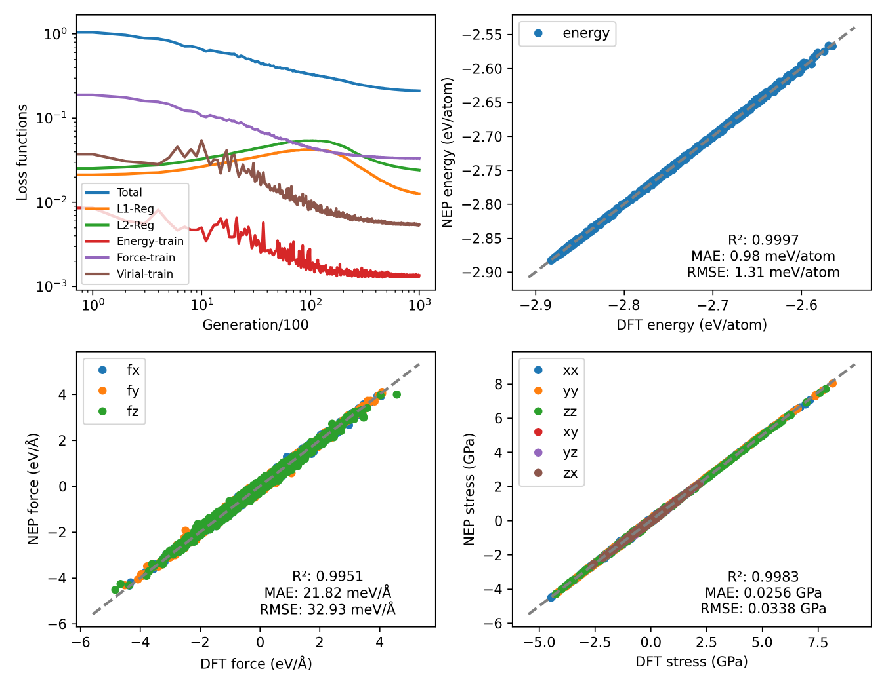
</div>

---

### plt_prediction.py

可视化 prediction 模式对 `train.xyz` 中结构生成的 NEP 预测结果。
prediction 模式的 parity 数据仍写入以 `_train.out` 结尾的文件。

**输入文件：** `energy_train.out`、`force_train.out`，以及优先读取的
包含有效行的 `stress_train.out`，或回退使用的 `virial_train.out`

```bash
gpumdkit.sh -plt prediction
gpumdkit.sh -plt test         # 替代命令
```

<div align="center">
  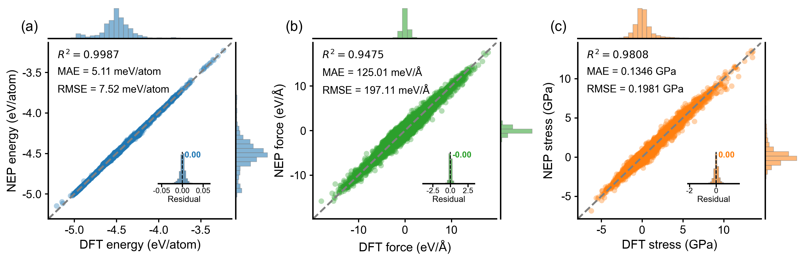
</div>

---

### plt_train_test.py

将训练集和测试集的 parity plot 合并显示。

**输入文件：** `energy_train.out`、`force_train.out`、`stress_train.out`、
`energy_test.out`、`force_test.out` 和 `stress_test.out`

```bash
gpumdkit.sh -plt train_test
```

<div align="center">
  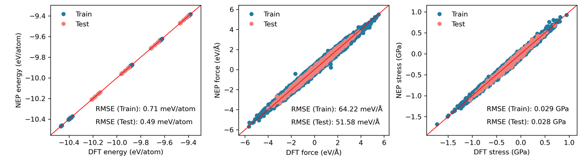
</div>

---

### plt_parity_density.py

生成基于密度的 parity plot，适用于大数据集（散点图过于密集时更易阅读）。

**输入文件：** `energy_train.out`、`force_train.out`，以及优先读取的
`stress_train.out` 或回退使用的 `virial_train.out`

```bash
gpumdkit.sh -plt parity_density
```

<div align="center">
  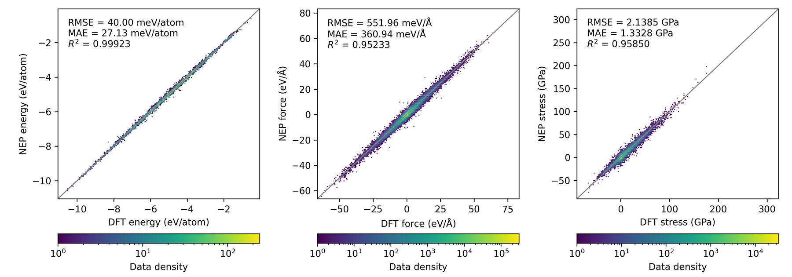
</div>

---

### plt_train_density.py

生成基于密度的 NEP 训练 parity 图（能量、力、应力或 virial）。同时存在两种
张量输出时优先使用应力。适用于散点图过密的大数据集。

**输入文件：** `energy_train.out`、`force_train.out`，以及优先读取的
`stress_train.out` 或回退使用的 `virial_train.out`

```bash
gpumdkit.sh -plt train_density
```

---

### plt_force_errors.py

参考 [Liu et al.](https://doi.org/10.1038/s41524-023-01123-3) 的方法绘制力误差评估指标。

**输入文件：** `force_train.out`

**显示指标：**
- 力大小误差 (delta_F)
- 力角度误差 (delta_theta)
- 误差分布

```bash
gpumdkit.sh -plt force_errors
```

<div align="center">
  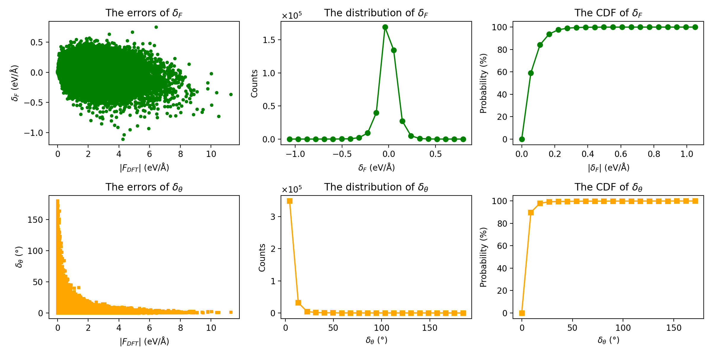
</div>

---

### plt_nep_restart.py

可视化 `nep.restart` 文件中存储的参数。

**输入文件：** `nep.restart`

```bash
gpumdkit.sh -plt restart
```

<div align="center">
  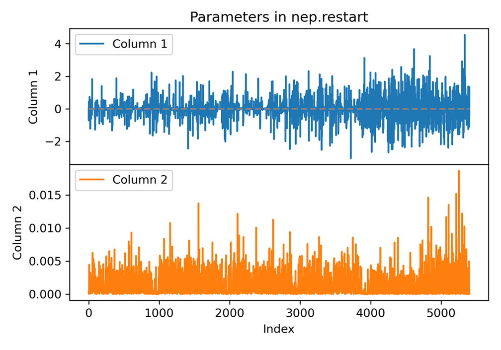
</div>

---

### plt_charge.py

绘制 `qNEP` 模型的电荷分布。

**输入文件：** `train.xyz` 和 `charge_train.out`

**重要提示：** 确保训练集和电荷输出的原子排序一致。建议使用全 batch 训练或先运行预测步骤。

```bash
gpumdkit.sh -plt charge
```

<div align="center">
  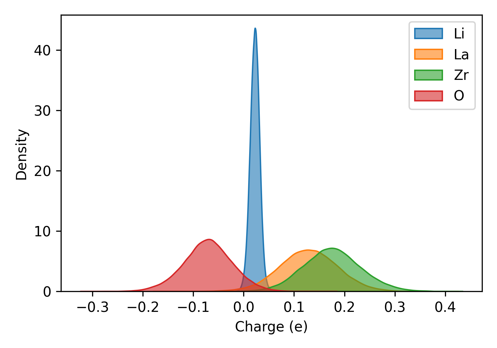
</div>

---

### plt_born_charge.py

为训练集和测试集创建 Born 有效电荷 (BEC) 的 parity plot。全零参考 BEC 的结构会被过滤。

**输入文件：** `bec_train.out`；可选 `bec_test.out`

```bash
gpumdkit.sh -plt born_charge
gpumdkit.sh -plt bec          # 替代命令
```

<div align="center">
  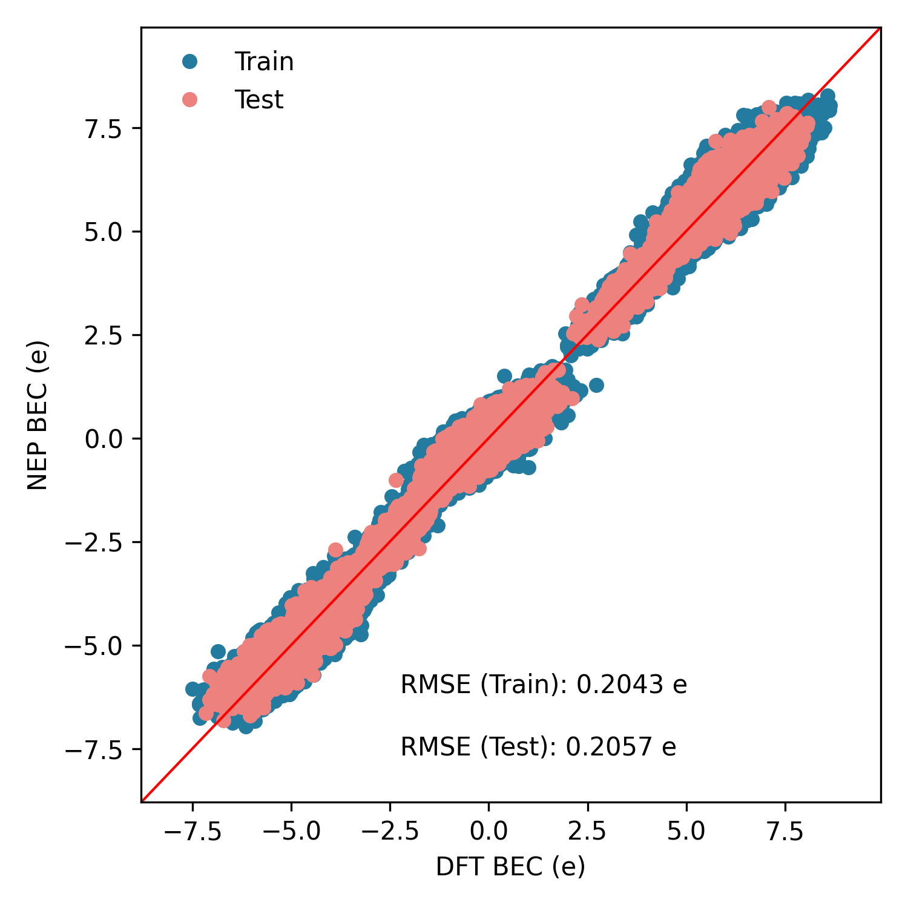
</div>

---

## 热力学量

### plt_thermo.py

综合可视化热力学性质的主脚本。

**输入文件：** `thermo.out`

```bash
gpumdkit.sh -plt thermo
```

<div align="center">
  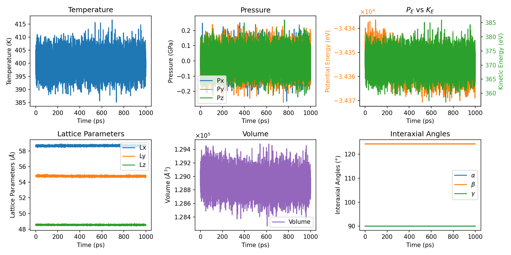
</div>

---

### plt_thermo2.py & plt_thermo3.py

不同风格的热力学量可视化。

**输入文件：** `thermo.out`

```bash
gpumdkit.sh -plt thermo2
gpumdkit.sh -plt thermo3
```

---

## 扩散和离子输运

### plt_msd.py

绘制各方向的均方位移 (MSD)。

**输入文件：** 前四列为时间和 `MSD_x/y/z` 的 `msd.out`。这包括
`gpumdkit.sh -calc msd` 生成的四列输出，以及 GPUMD `compute_msd` 输出的前四列。

图中的斜率使用 MSD 数据中间 40%–80% 的区间拟合。

```bash
gpumdkit.sh -plt msd
```

<div align="center">
  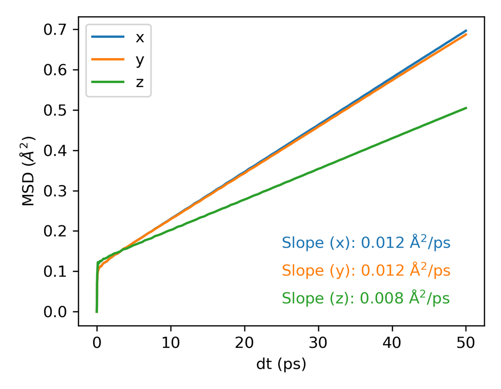
</div>

---

### plt_msd_all.py

当 GPUMD 中使用 `all_groups` 时，分别绘制每种原子的 MSD。

**输入文件：** `msd.out`（需要使用 `all_groups` 选项计算）

**要求：** `run.in` 中的 `compute_msd` 命令必须使用 `all_groups`。多个分组时，
GPUMD 会追加分组数据；请检查其布局，不要假定文件具有单分组结果的七列。

```bash
gpumdkit.sh -plt msd_all msd.out Li P S
```

<div align="center">
  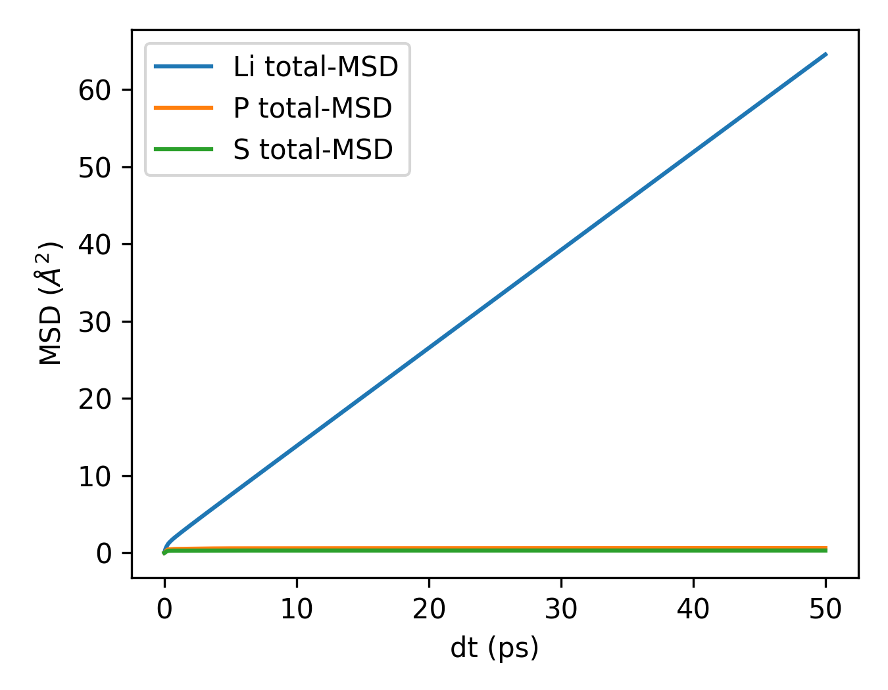
</div>

---

### plt_msd_convergence_check.py

检查不同时间窗口下 MSD 计算的收敛性。

**输入文件：** `msd_step*.out`（需要在 `compute_msd` 中使用 `save_every` 选项）

**要求：** 在 `compute_msd` 命令中使用 `save_every`。

**用途：** 验证 MSD 是否已充分收敛以准确计算扩散系数。

```bash
gpumdkit.sh -plt msd_conv
```

<div align="center">
  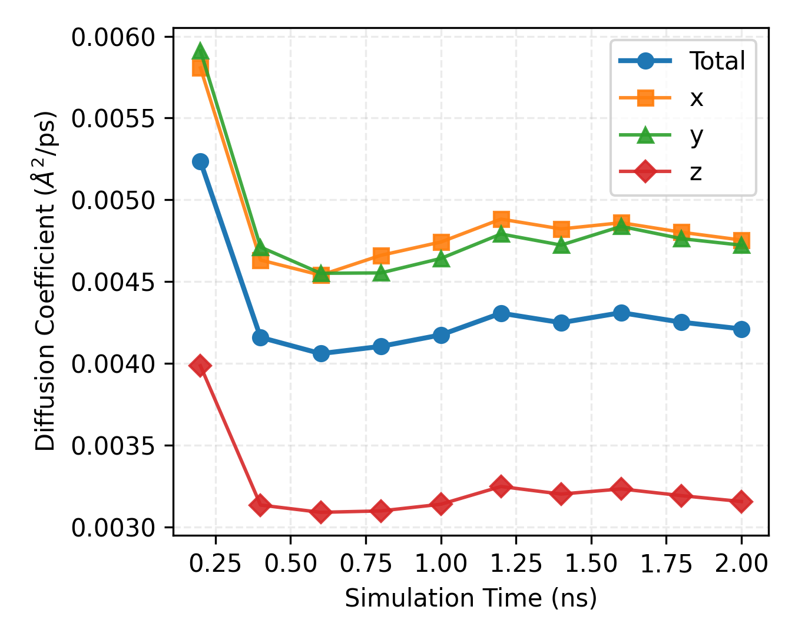
</div>

---

### plt_sdc.py

绘制自扩散系数 (SDC) 随时间的变化。

**输入文件：** GPUMD `compute_msd` 生成的单分组七列 `msd.out`：时间、
`MSD_x/y/z` 和 `SDC_x/y/z`。`-calc msd` 生成的四列文件不能用于该绘图。

```bash
gpumdkit.sh -plt sdc
```

<div align="center">
  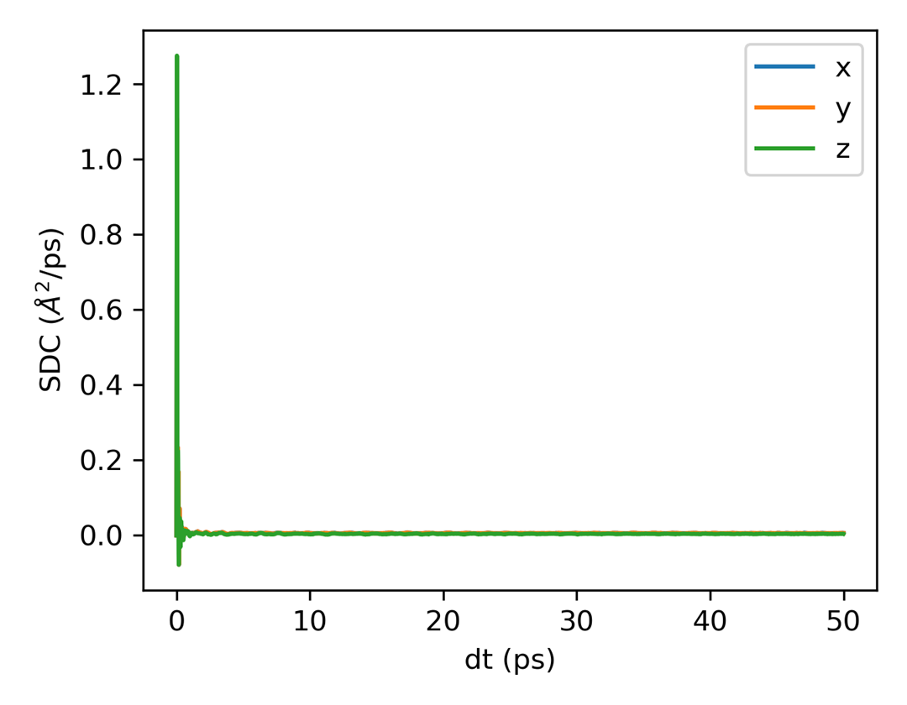
</div>

---

### plt_msd_sdc.py

并排绘制 MSD 和自扩散系数（SDC）。图中的斜率使用 MSD 数据中间 40%–80%
的区间拟合；右图插图展示 SDC 数据最后 80% 的部分，并叠加移动平均曲线。

**输入文件：** GPUMD `compute_msd` 生成的单分组七列 `msd.out`：时间、
`MSD_x/y/z` 和 `SDC_x/y/z`。`-calc msd` 生成的四列文件不能用于该绘图。

```bash
gpumdkit.sh -plt msd_sdc
```

---

### plt_arrhenius_d.py

创建 Arrhenius 扩散系数图（log10 D vs 1000/T）。

**输入文件：** `*K/msd.out`（每个温度子目录下的 `msd.out`）

```bash
gpumdkit.sh -plt arrhenius_d
gpumdkit.sh -plt D             # 替代命令
```

**输出示例：**

```text
T: 300K, D_total: 1.001e-07 cm2/s
T: 350K, D_total: 4.184e-07 cm2/s
T: 400K, D_total: 1.027e-06 cm2/s
Ea: 0.230 eV
```

<div align="center">
  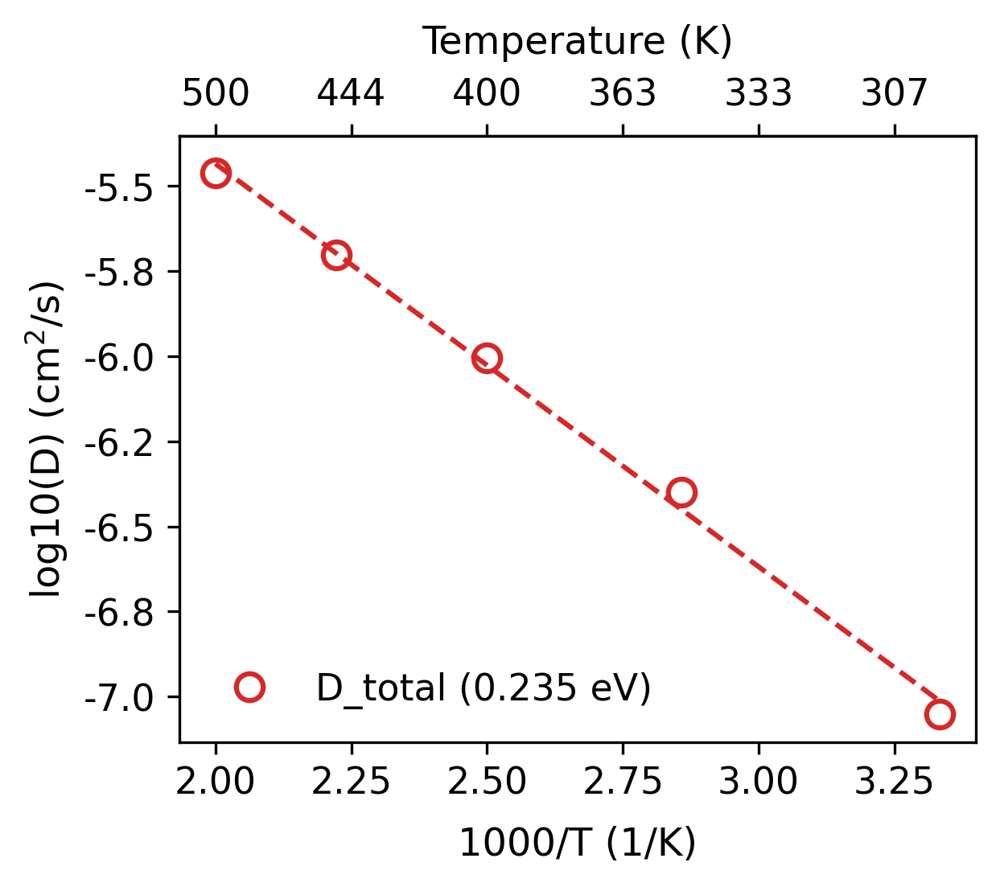
</div>

---

### plt_arrhenius_d_PT.py

在用户指定的相变温度两侧绘制分段 Arrhenius 扩散系数图。相变温度点同时纳入
`LowT`（`T <= Tc`）和 `HighT`（`T >= Tc`）两段拟合。

**输入文件：** `*K/msd.out`

```bash
gpumdkit.sh -plt D_PT 380
gpumdkit.sh -plt D_PT 380 save
```

图例会直接标出两段活化能，例如 `HighT (xx eV)` 和 `LowT (xx eV)`。

<div align="center">
  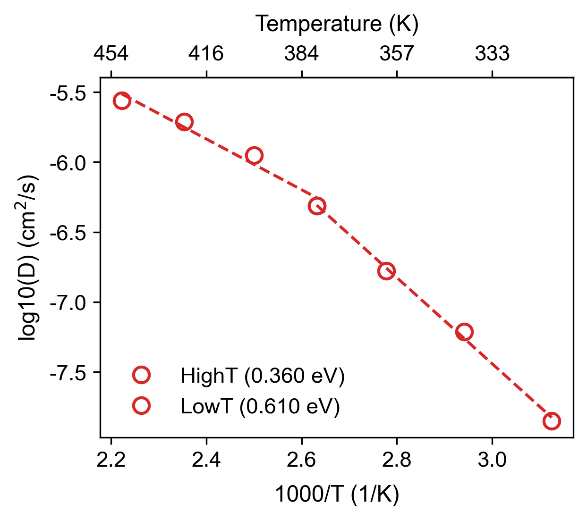
</div>

---

### plt_arrhenius_d_xyz.py

从各温度目录的 `msd.out` 计算 x/y/z 方向的扩散系数，绘制方向性 Arrhenius 图，
并对每个方向提取活化能。

**输入文件：** `*K/msd.out` 文件

```bash
gpumdkit.sh -plt D_xyz
```

输出会给出 `Ea_x`、`Ea_y`、`Ea_z` 三个方向的线性拟合结果。

---

### plt_arrhenius_sigma.py

创建 Arrhenius 离子电导率图（ln(σ·T) vs 1000/T）。

**输入文件：** 每个 `*K/` 目录中的 `thermo.out` 和 `msd.out`；首个温度目录中的
`model.xyz` 以及可选的 `run.in`

```bash
gpumdkit.sh -plt arrhenius_sigma
gpumdkit.sh -plt sigma         # 替代命令
```

<div align="center">
  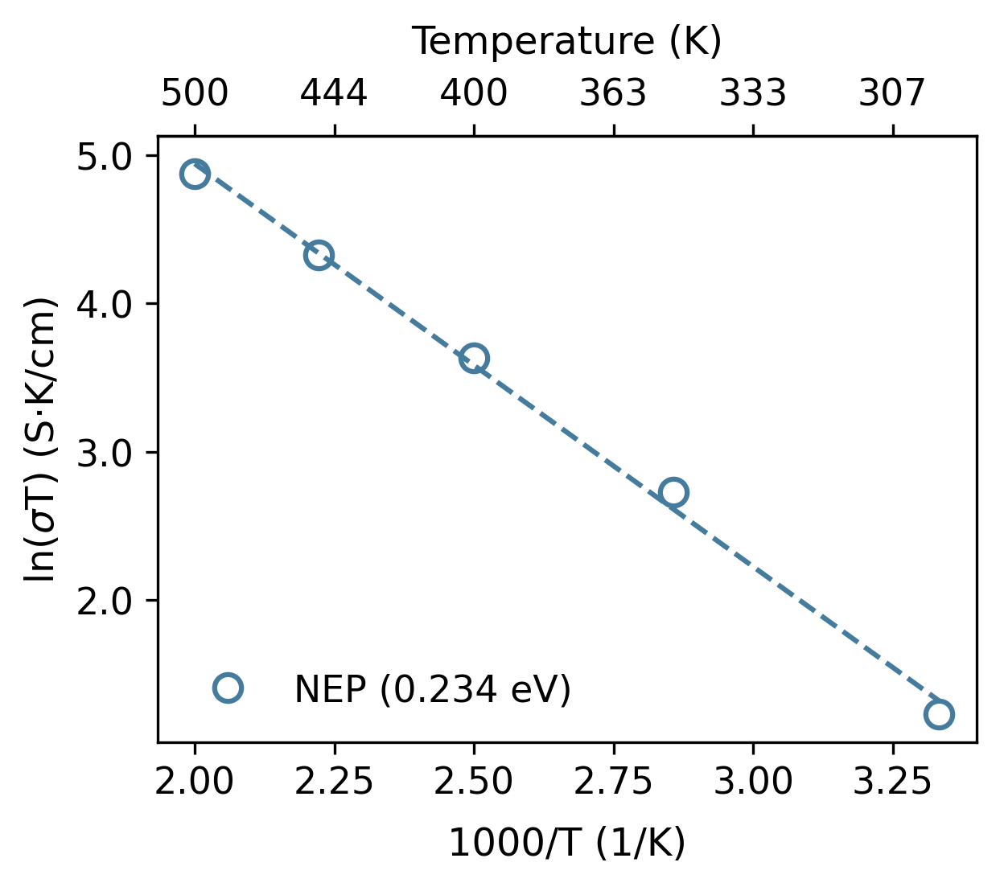
</div>

---

### plt_arrhenius_sigma_PT.py

在用户指定的相变温度两侧绘制分段 Arrhenius 离子电导率图。相变温度点同时纳入
`LowT`（`T <= Tc`）和 `HighT`（`T >= Tc`）两段拟合。300 K 电导率使用与
300 K 位于相变温度同一侧的分支外推。

**输入文件：** 每个 `*K/` 目录中的 `thermo.out` 和 `msd.out`；首个温度目录中的
`model.xyz` 以及可选的 `run.in`

```bash
gpumdkit.sh -plt sigma_PT 380
gpumdkit.sh -plt sigma_PT 380 save
```

图例会直接标出两段活化能，例如 `HighT (xx eV)` 和 `LowT (xx eV)`。

<div align="center">
  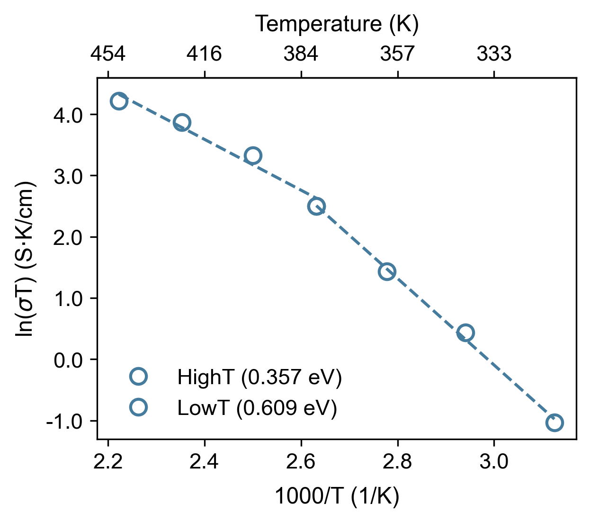
</div>

---

### plt_arrhenius_sigma_xyz.py

从各温度目录的 MSD 和热力学数据计算 x/y/z 方向的离子电导率，绘制方向性
Arrhenius 关系图，并用 Nernst-Einstein 关系提取每个方向的活化能。

**输入文件：** 每个 `*K/` 目录中的 `thermo.out` 和 `msd.out`；首个温度目录中的
`model.xyz`

```bash
gpumdkit.sh -plt sigma_xyz
```

---

## 热输运

### plt_emd.py

分析并绘制平衡分子动力学 (EMD) 热导率。

**输入文件：** GPUMD 的 EMD 输出文件

```bash
gpumdkit.sh -plt emd x --save-data        # 导出处理后的数据
gpumdkit.sh -plt emd x --save --save-data # 同时保存图片和数据
```

`--save` 将图片保存为 `emd.png`；`--save-data` 将处理后的数组保存为
`data_emd.npz` 和制表符分隔的 `data_emd.txt`，两个选项相互独立。为兼容
旧用法，仍接受不带连字符的 `save` 和 `save_data`。

<div align="center">
  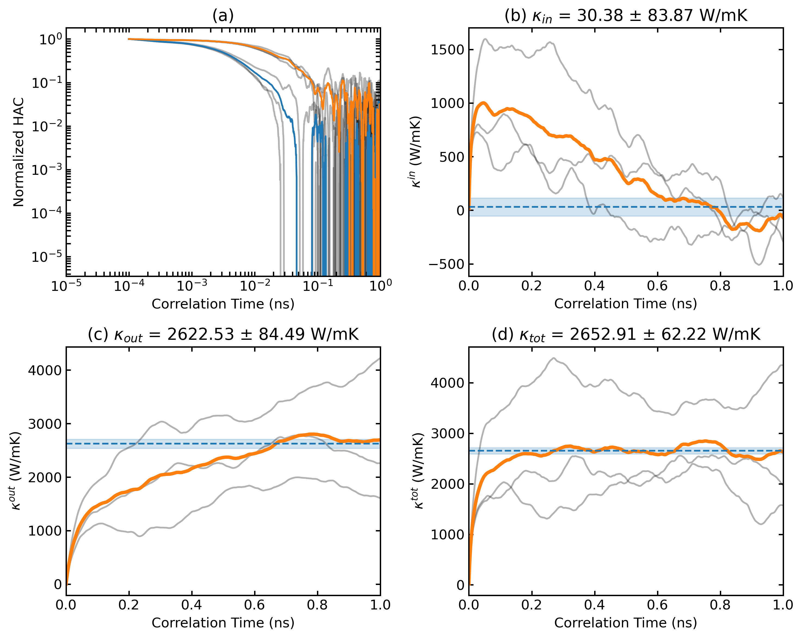
</div>

---

### plt_emd2.py

在同一幅图中绘制 x、y、z 三个方向的热流关联函数和 EMD 总热导率。该功能使用与
`plt_emd.py` 相同的 `run.in`、`hac.out` 和平均规则。

**输入文件：** GPUMD 的 EMD 输出文件

```bash
gpumdkit.sh -plt emd2             # 显示全部方向结果
gpumdkit.sh -plt emd2 save        # 保存为 emd2.png
```

HAC 图使用对数相关时间轴，同时在纵轴保留 HAC 的正负号。物理上为零的
方向会显示为零曲线。输出的不确定度沿用旧版规则，即后半段窗口波动除以
HAC 重复次数的平方根；它不是独立轨迹之间的标准误差。

<div align="center">
  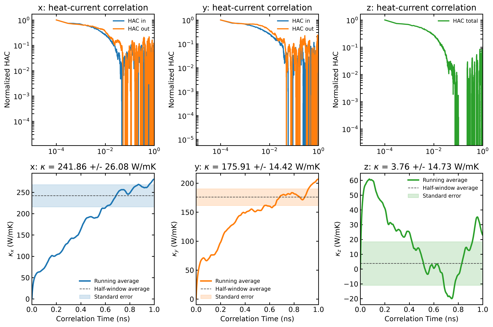
</div>

---

### plt_nemd.py

可视化非平衡分子动力学 (NEMD) 热输运性质。

**输入文件：** GPUMD 的 NEMD 输出文件

**参数说明：**

| 参数 | 说明 |
|------|------|
| `real_length` | 传热区实际长度（nm），设为 `Auto` 可自动计算 |
| `scale_eff_size` | 有效截面积缩放因子（默认：1）。三维体相用 1；含真空层的低维体系用 S_box / S_eff |
| `cutoff_freq` | SHC 计算的截止频率（THz，默认：60） |
| `--save` | 可选，保存图片为 `nemd.png` |
| `--save-data` | 可选，额外导出制表符分隔的 `data_nemd.txt`；存在 SHC 数据时还导出 `data_shc.txt` |

**注意：** 如果没有 SHC 数据，使用 `--save` 时请将 `scale_eff_size` 和 `cutoff_freq` 设为任意占位数字。

```bash
gpumdkit.sh -plt nemd [real_length] [scale_eff_size] [cutoff_freq] [--save] [--save-data]
gpumdkit.sh -plt nemd --save-data                         # 使用默认参数并导出数据
gpumdkit.sh -plt nemd Auto 1 60 --save --save-data       # 同时保存图片和数据
```

历史版本一直生成的 `data_nemd.npz`（以及存在 SHC 数据时的 `data_shc.npz`）仍会
照常写出。`--save` 和 `--save-data` 相互独立；为兼容旧用法，仍接受不带连字符的
`save` 和 `save_data`。

<div align="center">
  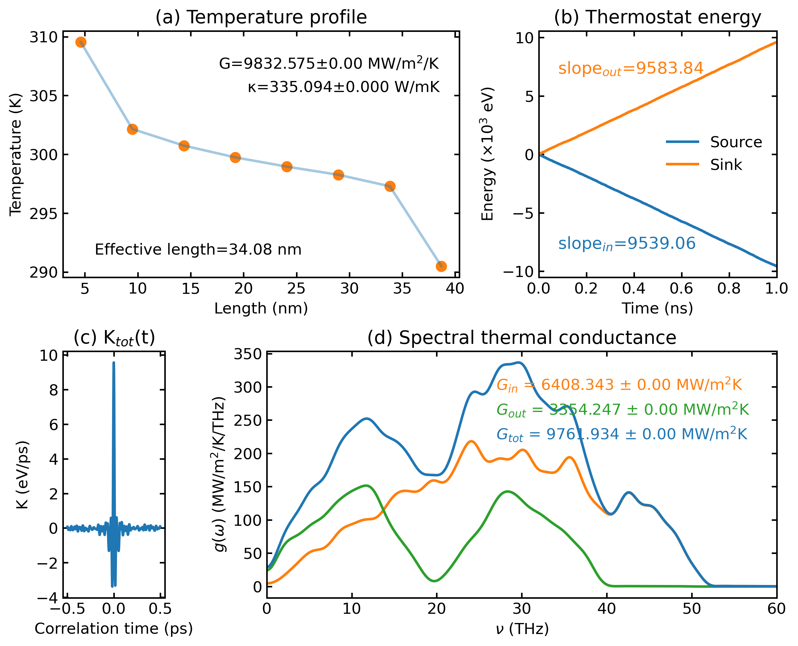
</div>

---

### plt_hnemd.py

绘制均匀非平衡分子动力学 (HNEMD) 结果。

**输入文件：** GPUMD 的 HNEMD 输出文件

**参数说明：**

| 参数 | 说明 |
|------|------|
| `scale_eff_size` | 有效截面积缩放因子（默认：1） |
| `cutoff_freq` | SHC 计算的截止频率（THz，默认：60） |
| `--save` | 可选，保存图片为 `hnemd.png` |
| `--save-data` | 可选，将处理后的数组保存为 `data_hnemd.npz` 和制表符分隔的 `data_hnemd.txt`；存在 SHC 数据时还保存 `data_shc.npz` 和 `data_shc.txt` |

**注意：** 如果没有 SHC 数据，使用 `--save` 时请将 `scale_eff_size` 和 `cutoff_freq` 设为任意占位数字。

```bash
gpumdkit.sh -plt hnemd [scale_eff_size] [cutoff_freq] [--save] [--save-data]
gpumdkit.sh -plt hnemd --save-data             # 使用默认参数并导出数据
gpumdkit.sh -plt hnemd 1 60 --save --save-data # 同时保存图片和数据
```

`--save` 和 `--save-data` 相互独立；为兼容旧用法，仍接受不带连字符的
`save` 和 `save_data`。

<div align="center">
  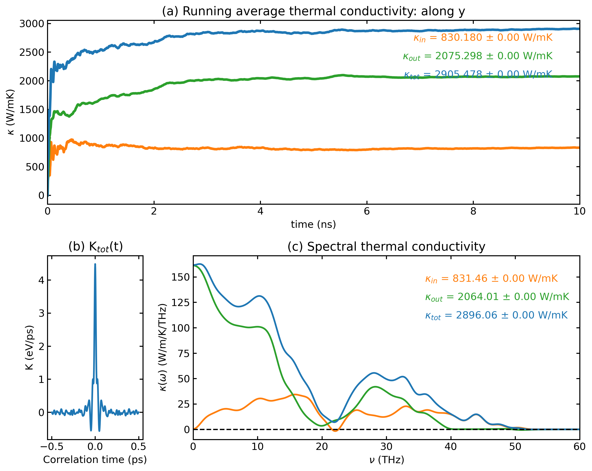
</div>

---

### plt_viscosity.py

绘制 `viscosity.out` 中的应力自相关和粘度分量，包括对角和非对角分量。

**输入文件：** GPUMD 粘度计算生成的 `viscosity.out`

```bash
gpumdkit.sh -plt viscosity
```

---

## 结构分析

### plt_rdf.py

绘制 `rdf.out` 中的所有 RDF 数值列（第 1 列半径用作横坐标）。

**输入文件：** `rdf.out`

```bash
gpumdkit.sh -plt rdf               # 显示所有 RDF 对
gpumdkit.sh -plt rdf save          # 将图保存为 rdf.png
```

`rdf` 绘图不提供单列选择。若需要选定一列进行 PMF 分析，请使用
`rdf_pmf`。

**RDF 输出：**

<div align="center">
  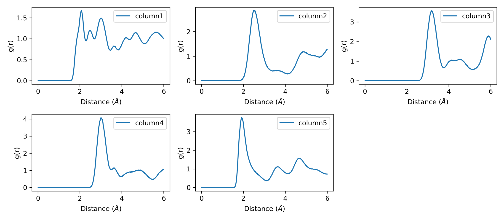
</div>

---

### plt_xrd.py

绘制计算器 413 生成的 X 射线衍射（XRD）输出。

**输入文件：** 默认读取 `xrd.out`；也可以将其他 XRD 输出文件路径作为第一个参数传入。

输入文件必须由计算器 413 生成。

```bash
gpumdkit.sh -plt xrd
gpumdkit.sh -plt xrd path/to/xrd.out save
```

使用 `save` 时，图片保存为当前工作目录下的 `xrd.png`。

**示例：**

<div align="center">
  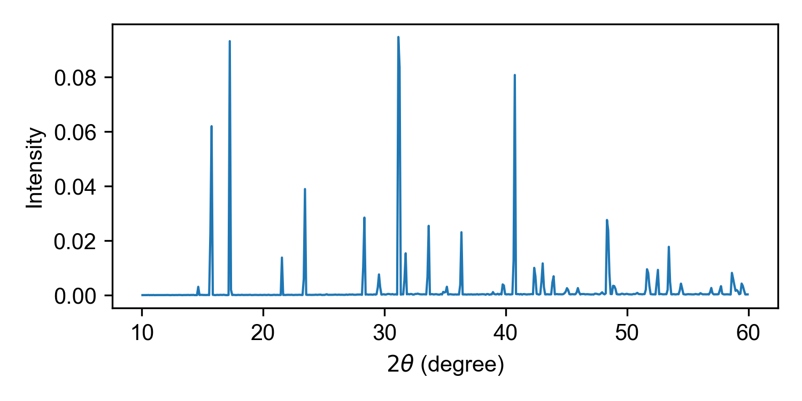
</div>

---

### plt_xrd_comp.py

比较当前工作目录下多个温度目录中的 XRD 曲线。每个目录必须命名为
`<temperature>K`，并包含由计算器 413 写出的 `xrd.out`。图像按照高温在上、
低温在下的顺序堆叠显示。

请先使用计算器 413 生成各温度目录中的 `xrd.out`，再运行温度对比。

请在包含多个 `*K` 子目录的目录中执行以下命令；该命令不接受目录参数：

```bash
cd /path/to/xrd_series
gpumdkit.sh -plt xrd_comp
gpumdkit.sh -plt xrd_comp save
```

使用 `save` 时，图片保存为当前工作目录下的 `xrd_comp.png`。

---

### plt_rdf_pmf.py

绘制 RDF 与平均力势 (PMF) 的组合图。

**输入文件：** `rdf.out`

```bash
gpumdkit.sh -plt rdf_pmf
gpumdkit.sh -plt rdf_pmf 300 2 save
```

`column_index` 选择 `rdf.out` 中的输出列：第 2 列是总 RDF，第 3 列及以后是原子对
RDF。

---

### plt_vac.py

绘制速度自相关函数 (VAC)。可用于分析声子性质和原子动力学。

**输入文件：** GPUMD `compute_sdc` 写入的 `sdc.out`（绘图脚本会从该文件中读取
VAC 相关列）。该文件与 `-plt sdc`、`-plt msd_sdc` 读取的 `msd.out` 不同。

**输出：** 交互式图表或 `vac.png`（使用 `save` 选项时）

```bash
gpumdkit.sh -plt vac
```

---

### plt_cohesive.py

从 `cohesive.out` 绘制内聚能曲线。可用于分析晶格稳定性和平衡晶格常数。

**输入文件：** `cohesive.out`（各向同性缩放因子 vs 内聚能）

**输出：** 交互式图表或 `cohesive.png`（使用 `save` 选项时）

```bash
gpumdkit.sh -plt cohesive
```

---

### plt_net_force.py

绘制结构上的净力分布，可用于识别问题构型。

**输入文件：** `train.xyz`（extxyz 格式）

```bash
gpumdkit.sh -plt net_force train.xyz
```

**参考文献：** [arXiv:2510.19774](https://arxiv.org/abs/2510.19774)

<div align="center">
  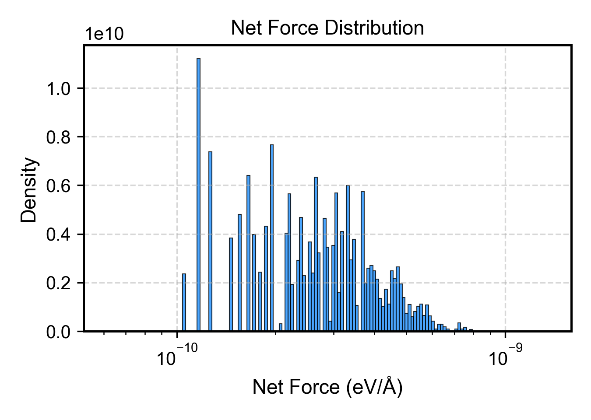
</div>

---

## 声子

### plt_phonon.py

绘制由计算器 `414` 生成的声子谱。绘图脚本会直接读取 line-mode 格式的
`QPOINTS` 文件中的 Q 点路径和高对称点标签，因此不需要在脚本中重复写死
路径。

**输入文件：** 声子数据文件（默认 `phonon_NEP.dat`）和 `QPOINTS`

计算步骤使用交互模式：

```text
gpumdkit.sh -> 4) Calculators -> 414) Calc phonon band structure
```

Python 页面会依次询问原胞结构（默认 `PRIMCELL.vasp`）、NEP 模型（默认
`nep.txt`）、路径文件（默认 `QPOINTS`）、超胞、位移幅度和输出文件名
（默认 `phonon_NEP.dat`）。该功能除了 GPUMDkit/Calorine 的常规依赖外，还
需要安装 `phonopy`。

绘图命令：

```bash
gpumdkit.sh -plt phonon
gpumdkit.sh -plt phonon phonon_DFT.dat
gpumdkit.sh -plt phonon phonon_NEP.dat QPOINTS save
```

声子数据文件可以省略；省略时绘图脚本读取 `phonon_NEP.dat`。如果只提供一个
数据文件，路径文件默认使用 `QPOINTS`。

不同的 Q 点路径段会分别绘制，避免在路径断点处产生伪连接。类似 `S|S₀` 的
边界标签会合并在同一个横坐标位置；标签默认保持同一高度，只有相邻标签拥挤
时才通过横向对齐尽量分开。

<div align="center">
  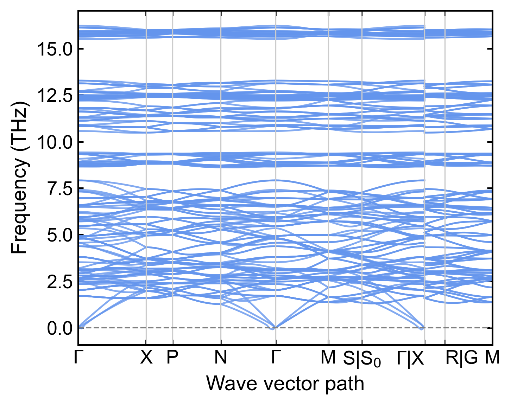
</div>

---

### plt_phonon_comp.py

比较两个或多个声子谱文件。图例会从文件名自动读取：`phonon_NEP.dat` 显示
为 `NEP`，`phonon_DFT.dat` 显示为 `DFT`，`phonon_MACE.dat` 显示为 `MACE`。

```bash
gpumdkit.sh -plt phonon_comp phonon_DFT.dat phonon_NEP.dat save
gpumdkit.sh -plt phonon_comp phonon_DFT.dat phonon_NEP.dat phonon_MACE.dat \
    --qpoints QPOINTS save
```

默认读取 `QPOINTS` 作为路径文件；如果路径文件名称不同，可以使用
`--qpoints FILE` 指定。两个文件比较时，DFT 使用灰色实线，NEP 使用砖红色
虚线；增加其他模型时会自动使用其他配色和线型。比较前会分别对断开路径段的
横坐标进行归一化，因此不同文件可以在路径跳跃处采用不同的偏移；但它们仍必须
使用相同的 q 点采样和声子支数。只有行数相同并不足以保证路径一致。

<div align="center">
  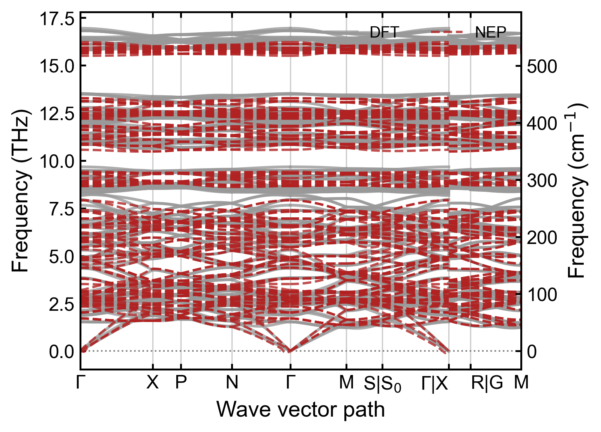
</div>

---

### plt_pdos.py

计算并绘制归一化的速度自相关函数 (VAC)、声子态密度 (PDOS) 和热容 (Cv)。

**输入文件：** `model.xyz`、`run.in`、`dos.out`、`mvac.out`

```bash
gpumdkit.sh -plt pdos
gpumdkit.sh -plt pdos save
```

<div align="center">
  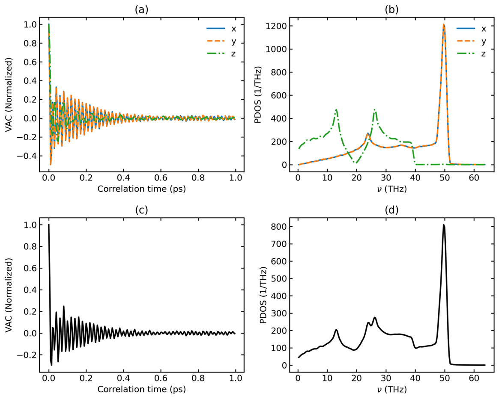
</div>

热容输出：

<div align="center">
  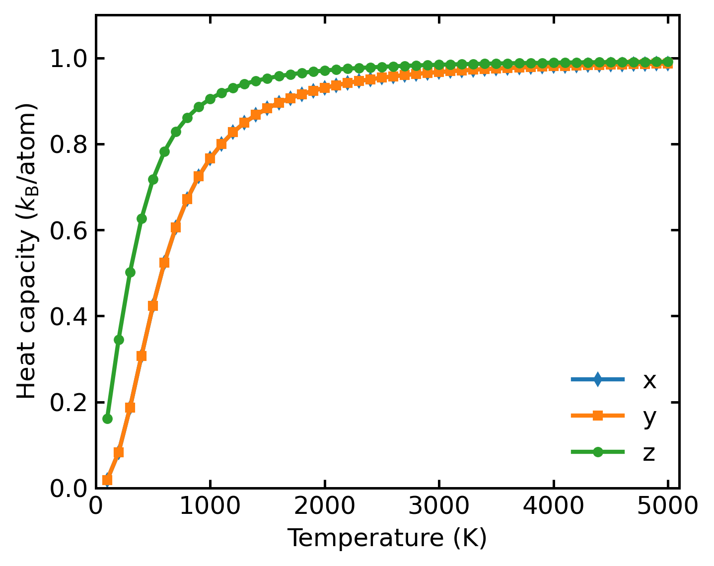
</div>

---

## 描述符、Dimer 和其他分析

### plt_descriptors.py

使用降维方法（PCA 或 UMAP）可视化高维 NEP 描述符。

**输入文件：** `descriptors.npy`（由 `gpumdkit.sh -calc des` 生成）

**方法：**
- `pca` — 主成分分析
- `umap` — 统一流形逼近与投影

```bash
# 先计算描述符
gpumdkit.sh -calc des train.xyz descriptors.npy nep.txt Li

# 再可视化
gpumdkit.sh -plt des pca descriptors.npy
gpumdkit.sh -plt des umap descriptors.npy
```

<div align="center">
  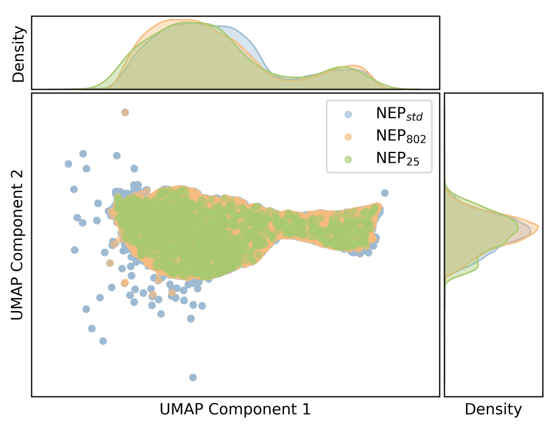
</div>

---

### plt_dimer.py

绘制二聚体相互作用曲线。将两个原子放入立方盒子（30 Å），使用 NEP 模型计算势能和力随距离的变化。

**输入文件：** `nep.txt`

```bash
gpumdkit.sh -plt dimer <element1> <element2> <nep_model>
gpumdkit.sh -plt dimer Li Li nep.txt
```

<div align="center">
  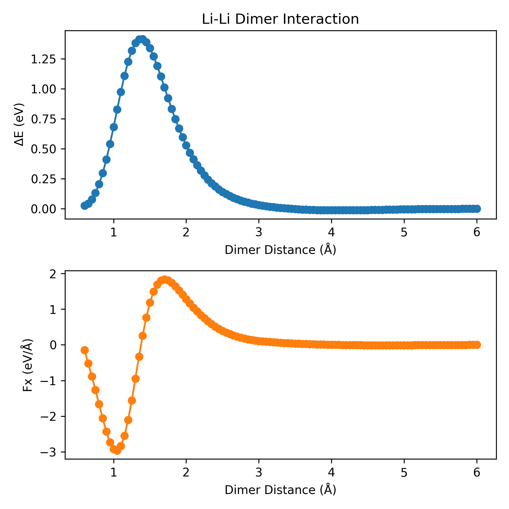
  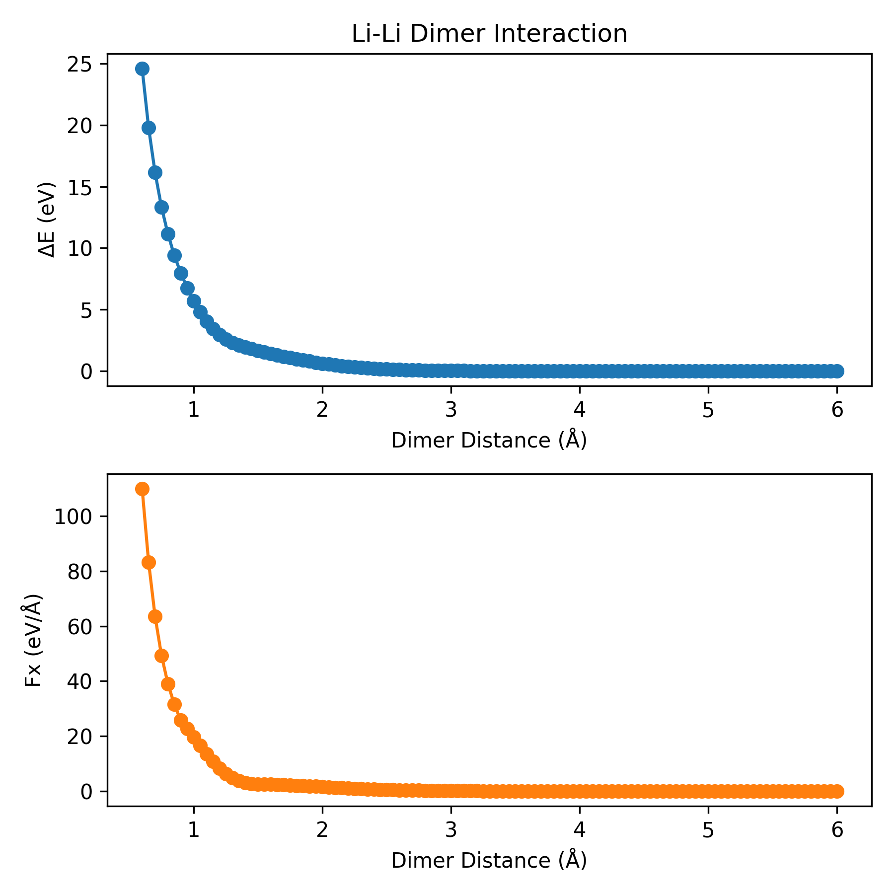
</div>

**参考文献：** [J. Chem. Inf. Model. 2026, 66, 3, 1406-1413](https://doi.org/10.1021/acs.jcim.5c02335)

---

### plt_doas.py

绘制 [Wang et al.](https://doi.org/10.1002/anie.202215544) 提出的原子态密度 (DOAS)。

**输入文件：** `doas.out`（由 `gpumdkit.sh -calc doas` 计算）

```bash
gpumdkit.sh -plt doas <doas.out> <species>
gpumdkit.sh -plt doas doas.out Li
```

<div align="center">
  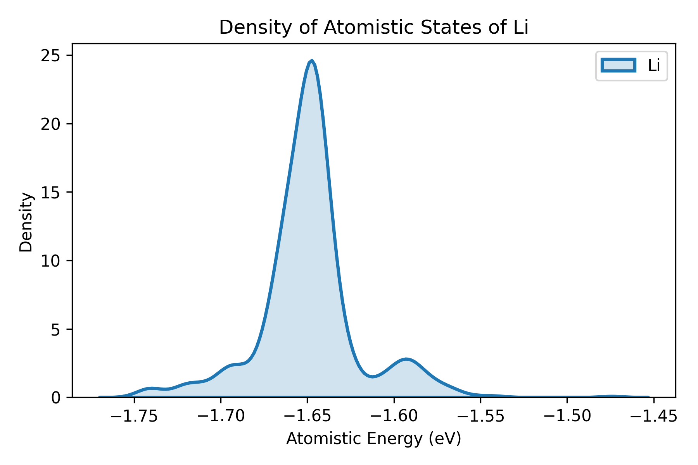
</div>

---

## 极性材料的 Plane-Grid 绘图

此工作流将位移或极化数据映射到网格上，并绘制选定平面的轮廓。详细用法和实际案例请参见 **[极性材料分析](极性材料分析.md)**。

**依赖：**

```bash
pip3 install git+https://github.com/MoseyQAQ/ferrodispcalc.git
```

**典型前置步骤：**

```bash
gpumdkit.sh -calc nlist -i model.xyz -c 4 -n 12 -C Pb Sr -E O
gpumdkit.sh -calc disp -i movie.xyz -n nl-Pb_Sr-O.dat -o displacements.dat
gpumdkit.sh -calc avg-struct -i movie.xyz -l 0.2 -o averaged_structure.xyz
```

**使用方法：**

```bash
gpumdkit.sh -plt plane-grid -i averaged_structure.xyz -d displacements.dat -e Pb Sr
gpumdkit.sh -plt plane-grid -i averaged_structure.xyz -d displacements.dat -e Pb Sr --select-xy 0 1
```

---

## 快速参考表

| 命令 | 输入文件 | 用途 |
|------|----------|------|
| `train` | `loss.out`, `*_train.out` | NEP 训练结果 |
| `prediction` / `test` | `*_train.out` | `train.xyz` 的 prediction 模式 parity 结果 |
| `train_test` | `*_train.out`, `*_test.out` | 合并 parity plot |
| `parity_density` | `*_train.out` | 密度 parity plot |
| `force_errors` | `force_train.out` | 力误差指标 |
| `restart` | `nep.restart` | 重启文件参数 |
| `charge` | `train.xyz`, `charge_train.out` | 电荷分布 |
| `born_charge` / `bec` | `bec_train.out`, 可选 `bec_test.out` | Born 有效电荷 |
| `thermo` | `thermo.out` | 热力学量 |
| `thermo2` / `thermo3` | `thermo.out` | 其他样式的热力学量绘图 |
| `msd` | `-calc msd` 生成的四列 `msd.out`，或 GPUMD `compute_msd` 输出的前四列 | 均方位移 |
| `msd_all` | `msd.out` (all_groups) | 全组分 MSD |
| `msd_conv` | `msd_step*.out` | MSD 收敛性检查 |
| `sdc` | GPUMD `compute_msd` 单分组七列 `msd.out` | 自扩散系数 |
| `msd_sdc` | GPUMD `compute_msd` 单分组七列 `msd.out` | MSD 和 SDC 合并 |
| `arrhenius_d` / `D` | `*K/msd.out` | Arrhenius 扩散系数 |
| `arrhenius_sigma` / `sigma` | `*K/{thermo.out, msd.out}`，以及首个温度目录中的 `model.xyz` 和可选 `run.in` | Arrhenius 离子电导率 |
| `D_PT` | `*K/msd.out` 以及相变温度 | 相变温度两侧的分段 Arrhenius 扩散系数 |
| `sigma_PT` | `*K/{thermo.out, msd.out}`，首个目录中的 `model.xyz`、可选 `run.in` 以及相变温度 | 相变温度两侧的分段 Arrhenius 离子电导率 |
| `D_xyz` | `*K/msd.out` | 方向性 Arrhenius 扩散系数（x/y/z） |
| `sigma_xyz` | `*K/{thermo.out, msd.out}` 加首个目录 `model.xyz` | 方向性 Arrhenius 离子电导率（x/y/z） |
| `rdf` | `rdf.out` | 径向分布函数 |
| `rdf_pmf` | `rdf.out` | RDF + 平均力势 |
| `xrd` | `xrd.out` | XRD 强度曲线 |
| `xrd_comp` | `*K/xrd.out` | 不同温度的 XRD 对比 |
| `vac` | `sdc.out` | 速度自相关 |
| `cohesive` | `cohesive.out` | 内聚能曲线 |
| `net_force` | `train.xyz` | 净力分布 |
| `doas` | `doas.out` | 原子态密度 |
| `des` | `descriptors.npy` | 描述符 PCA/UMAP |
| `dimer` | `nep.txt` | 二聚体能量/力曲线 |
| `pdos` | `model.xyz`, `run.in`, `dos.out`, `mvac.out` | VAC 和 PDOS |
| `phonon` | phonopy 能带数据 | 声子谱 |
| `phonon_comp` | phonopy 能带数据 | 声子谱对比 |
| `emd` | EMD 输出 | 单个方向的 EMD 热导率 |
| `emd2` | EMD 输出 | 全部方向的 EMD 热导率 |
| `nemd` | NEMD 输出 | NEMD 热输运 |
| `hnemd` | HNEMD 输出 | HNEMD 热输运 |
| `viscosity` | `viscosity.out` | 应力自相关与粘度分量 |
| `plane-grid` | `model.xyz`、`displacements.dat` | 位移平面网格分布 |
